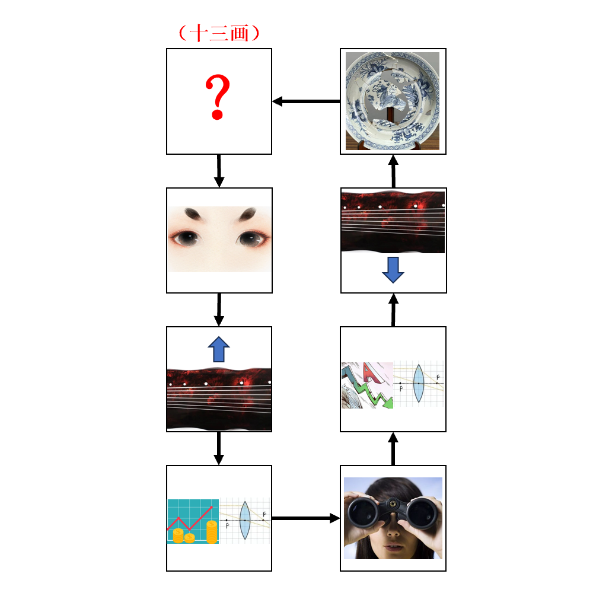

# 千字谜子题 26

## 题面

## 答案

`新`

## 解析

识图联想可得图片分别为：蛾眉、上弦、盈凸、望、亏凸、下弦、残，即八个月相，问号处为新月/朔月，答案为新（十三画）

## 本地附件

- [4db70e2c6e3248688219b4770f1a2fb8.webp](../../../assets/static.cipherpuzzles.com/static/images/4db70e2c6e3248688219b4770f1a2fb8.webp)

来源：[https://ccbc16.cipherpuzzles.com/data/c16-qian-puzzle.json#cid=26](https://ccbc16.cipherpuzzles.com/data/c16-qian-puzzle.json#cid=26)
