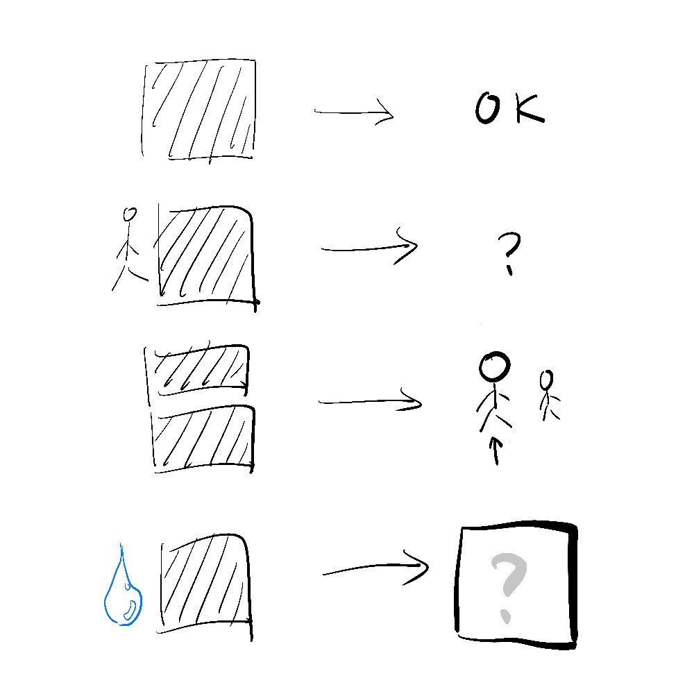

# 千字谜子题 260

## 题面

## 答案

`河`

## 解析

第一行表示可以/可行，为“可”；第二行加上单人旁表疑问，为“何”；第三行上下同字表兄弟中的长者，为“哥”；第四行加水偏旁，为“河”。

## 本地附件

- [67fd7ee11a9742429c06199c82bc788a.webp](../../../assets/static.cipherpuzzles.com/static/images/67fd7ee11a9742429c06199c82bc788a.webp)

来源：[https://ccbc16.cipherpuzzles.com/data/c16-qian-puzzle.json#cid=260](https://ccbc16.cipherpuzzles.com/data/c16-qian-puzzle.json#cid=260)
