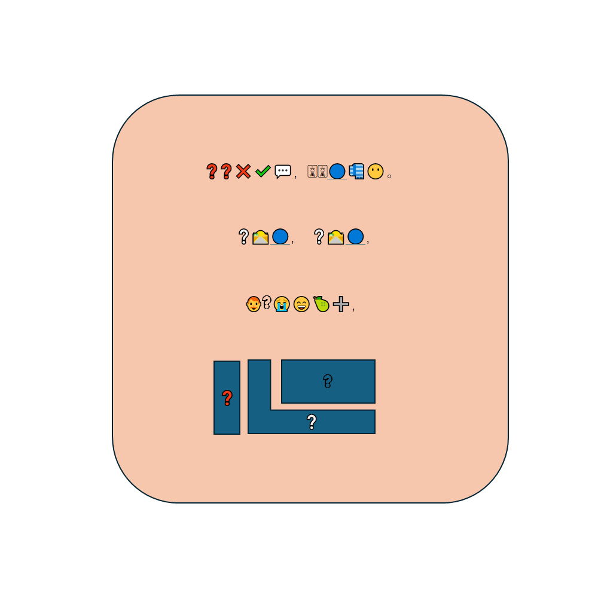

# 千字谜子题 261

## 题面

## 答案

`随`

## 解析

修正内容：将长风破浪会有时改为了人有悲欢离合，并修正了问号颜色。
emoji组诗词：耳耳非佳语，陆陆难为颜；行路难，行路难，；人有悲欢离合；问号部分是耳，行，有，对应包耳旁，走字底和有，拼字得到随。

## 本地附件

- [f42d85e536854e51895760550d123fe8.webp](../../../assets/static.cipherpuzzles.com/static/images/f42d85e536854e51895760550d123fe8.webp)

来源：[https://ccbc16.cipherpuzzles.com/data/c16-qian-puzzle.json#cid=261](https://ccbc16.cipherpuzzles.com/data/c16-qian-puzzle.json#cid=261)
