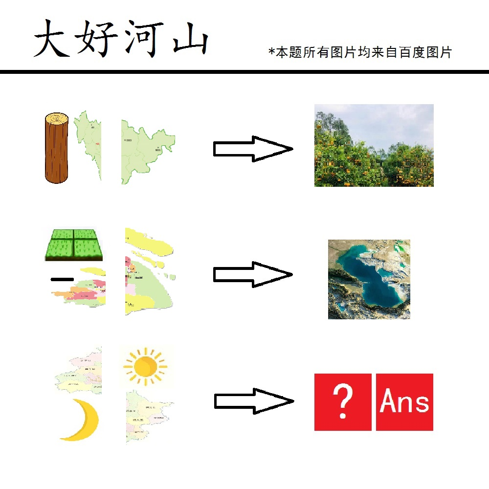

# 千字谜子题 262

## 题面

## 答案

`景`

## 解析

左侧三张被切割挤压的行政规划图分别为吉林省、上海市、北京市
而右侧两张图分别为桔林与里海，为左侧卡通图片+省会名称组合得到
则第三行结果应为北+月、日+景→背景，依照Ans提示得到答案为景

## 本地附件

- [d9693a15b2364dddac48951959c88c40.webp](../../../assets/static.cipherpuzzles.com/static/images/d9693a15b2364dddac48951959c88c40.webp)

来源：[https://ccbc16.cipherpuzzles.com/data/c16-qian-puzzle.json#cid=262](https://ccbc16.cipherpuzzles.com/data/c16-qian-puzzle.json#cid=262)
