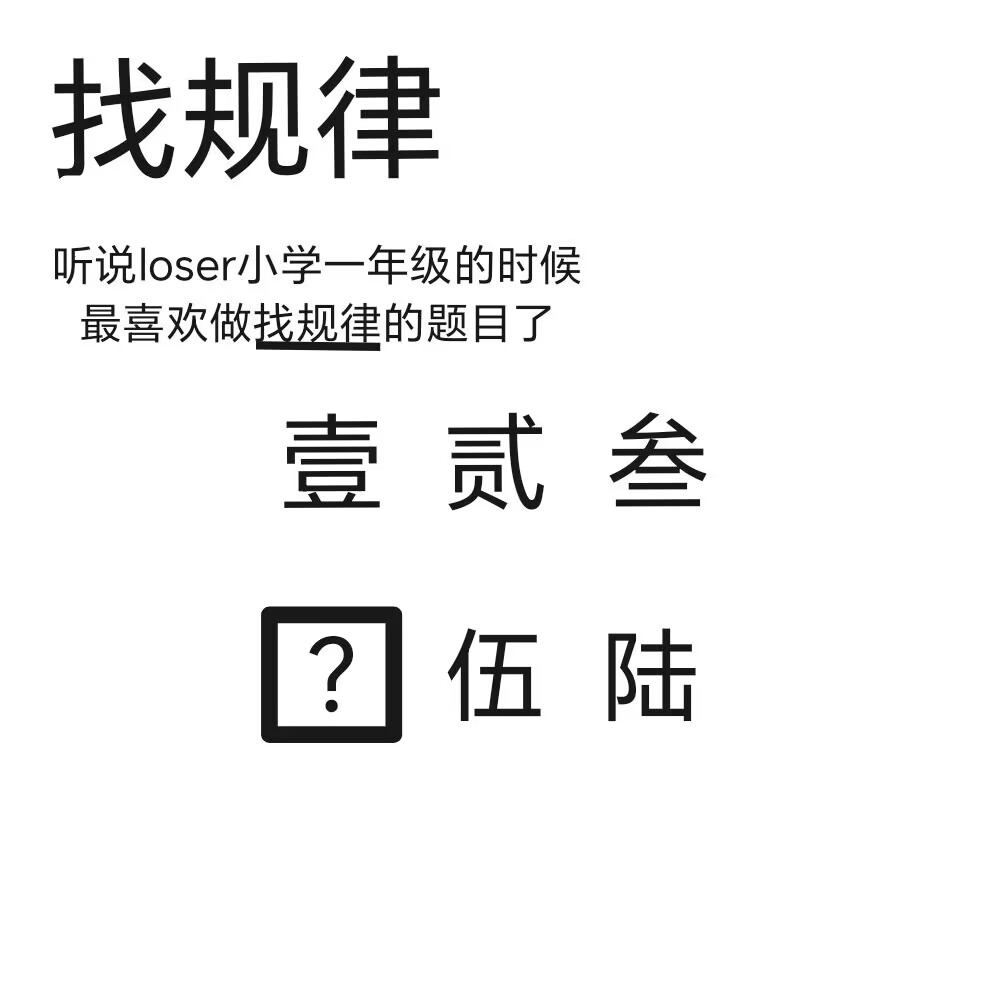

# 千字谜子题 264

## 题面

## 答案

`肆`

## 解析

找规律，并且能够准确找出方框内问号所表达的准确含义

## 本地附件

- [bcb48d562fa248e6b03b5188b44311b7.webp](../../../assets/static.cipherpuzzles.com/static/images/bcb48d562fa248e6b03b5188b44311b7.webp)

来源：[https://ccbc16.cipherpuzzles.com/data/c16-qian-puzzle.json#cid=264](https://ccbc16.cipherpuzzles.com/data/c16-qian-puzzle.json#cid=264)
