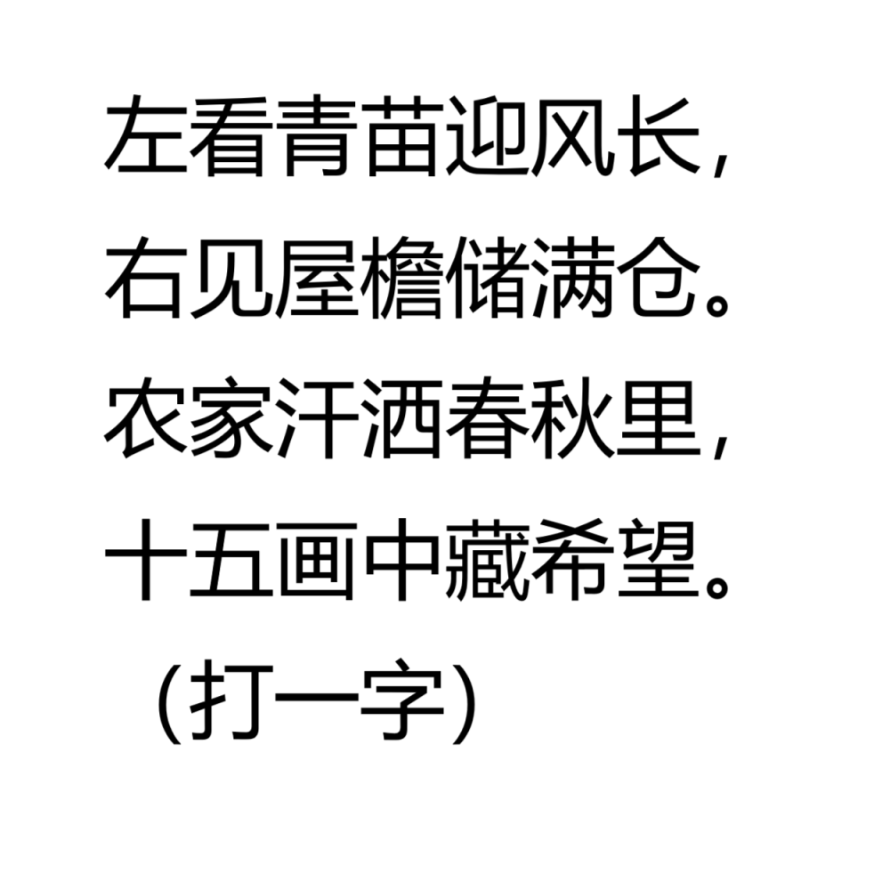

# 千字谜子题 266

## 题面

## 答案

`稼`

## 解析

这是一个灯谜，第一句是禾，第二句是家，第三句代表这个字的意思，第四句可以肯定就是“稼”，正好15笔画。

## 本地附件

- [ddb3640f938c4b608e72bec23bd0df20.webp](../../../assets/static.cipherpuzzles.com/static/images/ddb3640f938c4b608e72bec23bd0df20.webp)

来源：[https://ccbc16.cipherpuzzles.com/data/c16-qian-puzzle.json#cid=266](https://ccbc16.cipherpuzzles.com/data/c16-qian-puzzle.json#cid=266)
