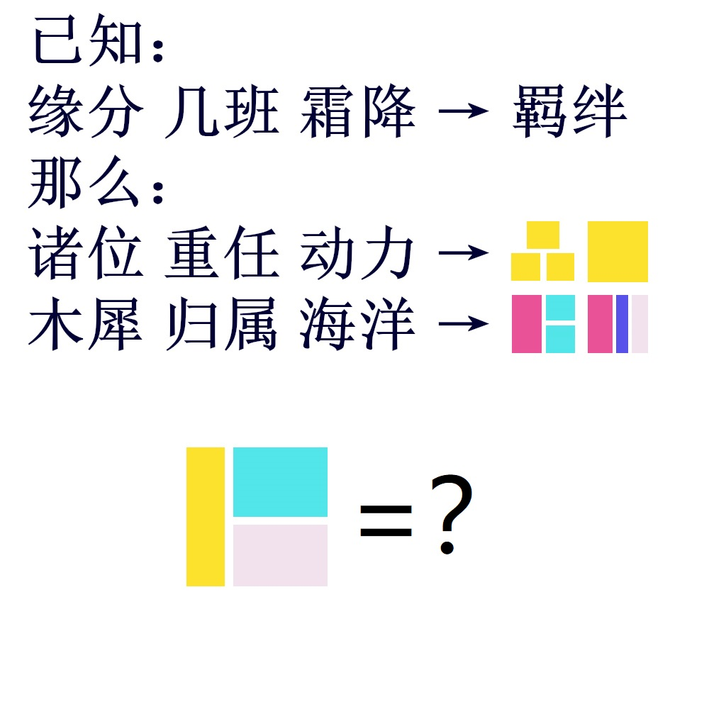

# 千字谜子题 268

## 题面

## 答案

`侍`

## 解析

由已知可得，三个词语从左往右分别对应 词义 词音 笔画
结合后面的字形线索可以推出两个词语分别为 众人 桂树
所以三个部件分别是 人 土 寸
即答案为 侍

## 本地附件

- [f99ef96122864f8f9acdbb644326b34d.webp](../../../assets/static.cipherpuzzles.com/static/images/f99ef96122864f8f9acdbb644326b34d.webp)

来源：[https://ccbc16.cipherpuzzles.com/data/c16-qian-puzzle.json#cid=268](https://ccbc16.cipherpuzzles.com/data/c16-qian-puzzle.json#cid=268)
