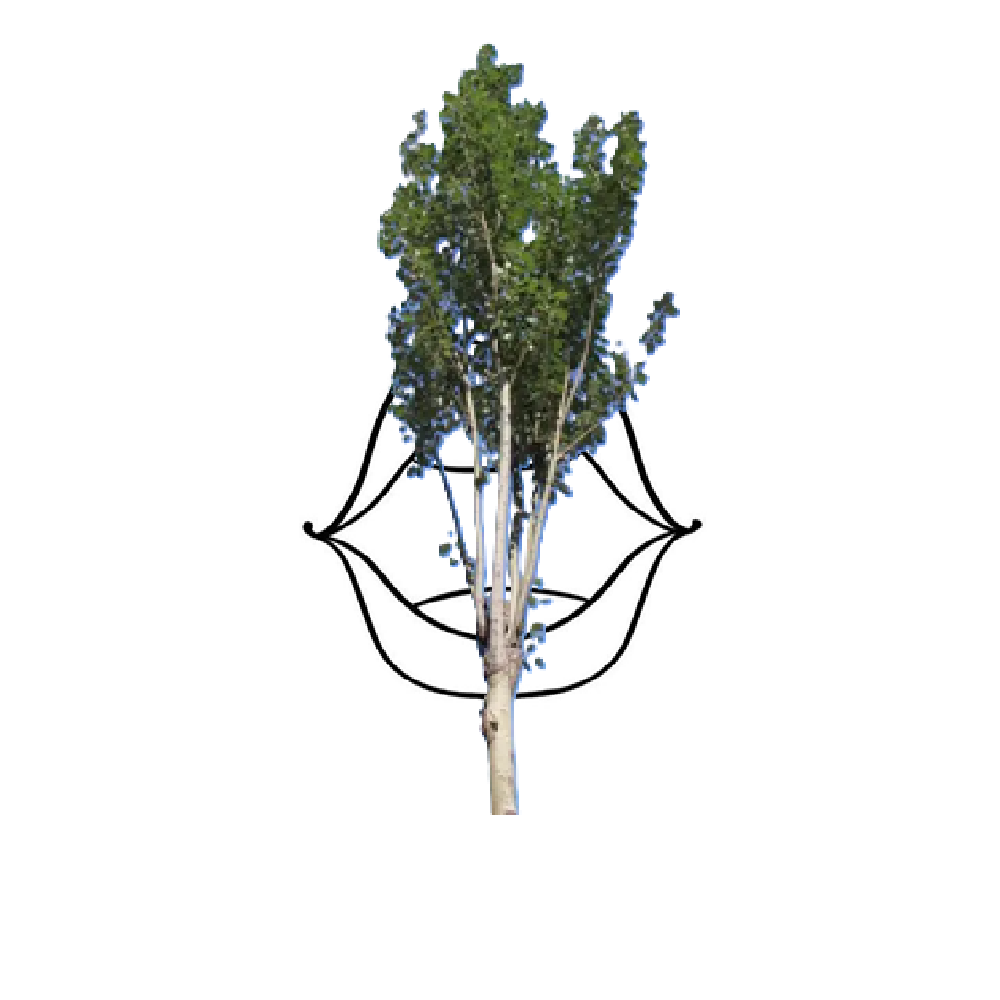

# 千字谜子题 269

## 题面

## 答案

`束`

## 解析

一个口上面放着一个树木，故在口上面放置一个木，而木较长故为束。

## 本地附件

- [44acb41331cb4b2ab4aa7c6687b4fabd.webp](../../../assets/static.cipherpuzzles.com/static/images/44acb41331cb4b2ab4aa7c6687b4fabd.webp)

来源：[https://ccbc16.cipherpuzzles.com/data/c16-qian-puzzle.json#cid=269](https://ccbc16.cipherpuzzles.com/data/c16-qian-puzzle.json#cid=269)
