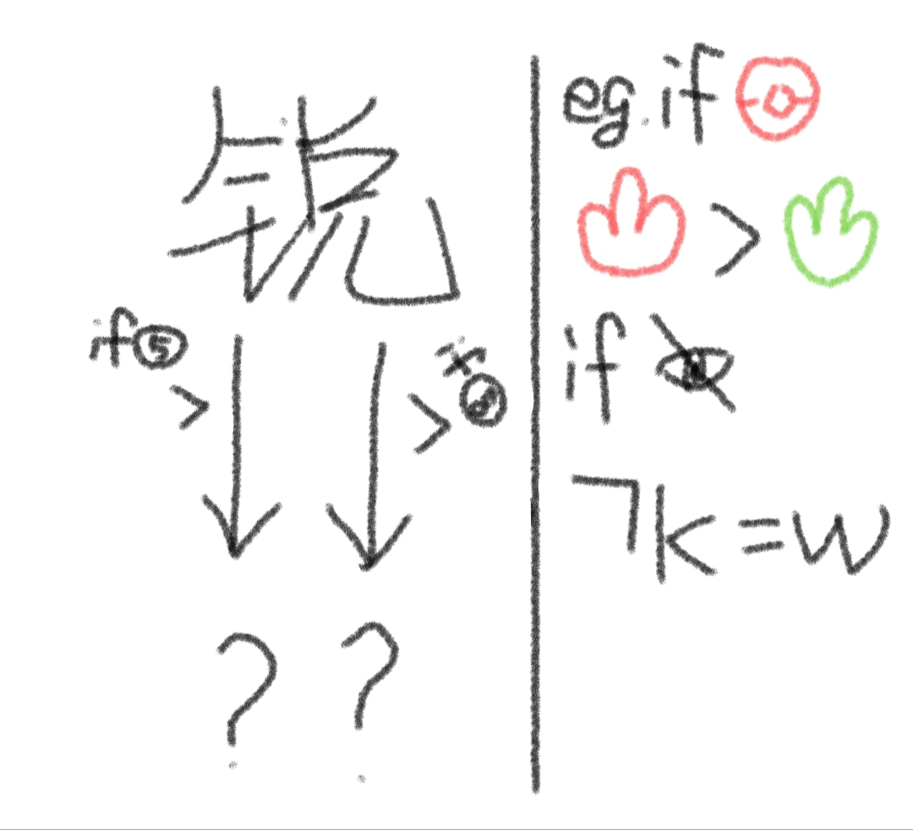

# 千字谜子题 27

## 题面

（十）

## 答案

`根`

## 解析

根据提示：if宝可梦 火“克”草
if盲文 k“取反”为w
因此根据if的文字方向我们可以知道：
左边为克制，⑤表示五行，五行中金克木
右边为取反，⑧为八卦，八卦中兑取反为艮
拼起来为根

## 本地附件

- [e050600376dd4ff18a0a90b5d60c54bd.webp](../../../assets/static.cipherpuzzles.com/static/images/e050600376dd4ff18a0a90b5d60c54bd.webp)

来源：[https://ccbc16.cipherpuzzles.com/data/c16-qian-puzzle.json#cid=27](https://ccbc16.cipherpuzzles.com/data/c16-qian-puzzle.json#cid=27)
