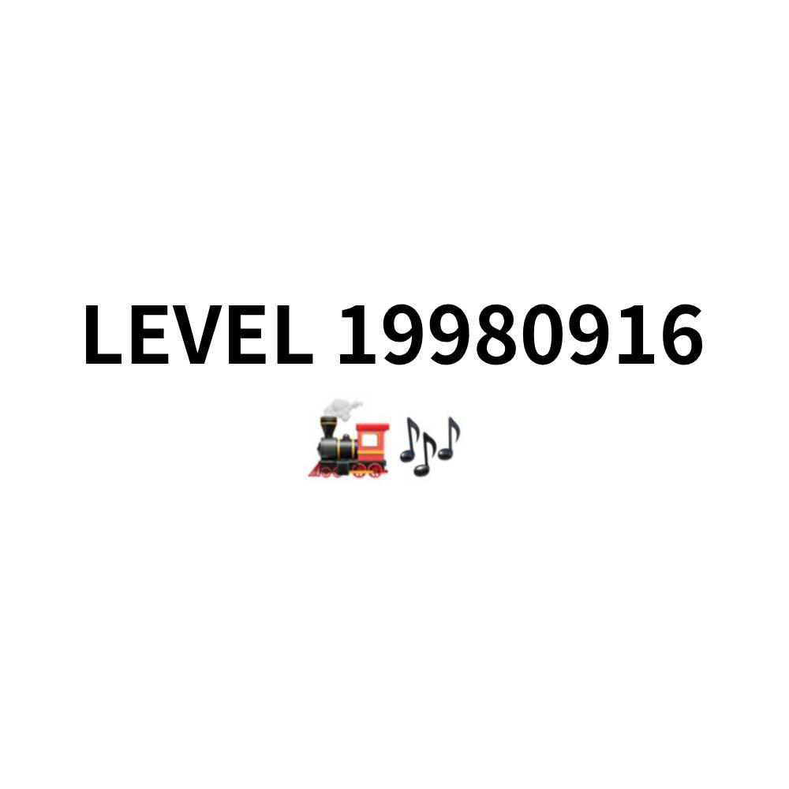

# 千字谜子题 271

## 题面

## 答案

`当`

## 解析

emoji配合题目标题解释为动力火车（歌手）1998年9月16日发行的歌曲。答案为：《当》。

## 本地附件

- [6d1370906a8241679a70849c9bfb16ae.webp](../../../assets/static.cipherpuzzles.com/static/images/6d1370906a8241679a70849c9bfb16ae.webp)

来源：[https://ccbc16.cipherpuzzles.com/data/c16-qian-puzzle.json#cid=271](https://ccbc16.cipherpuzzles.com/data/c16-qian-puzzle.json#cid=271)
