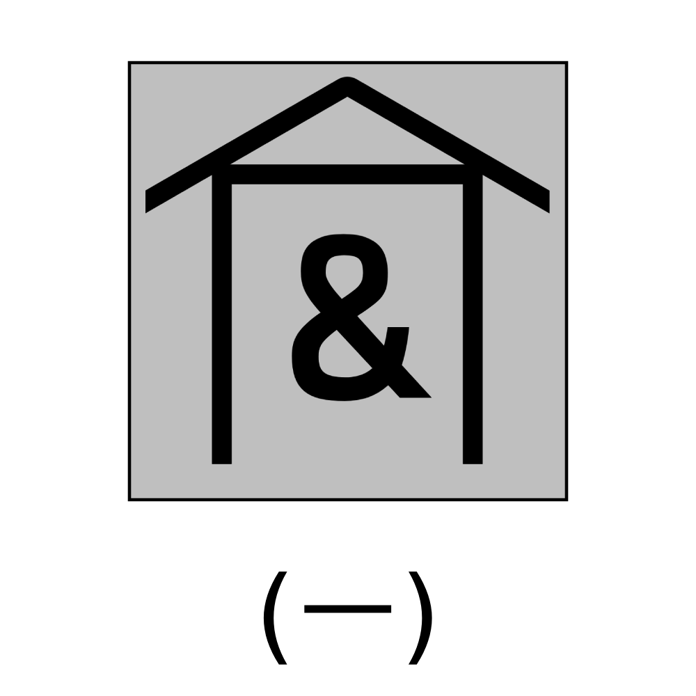

# 千字谜子题 272

## 题面

## 答案

`宜`

## 解析

图片中是一个在房子下的 & 符号，房子是“宀”的意思，&是“且”的意思，组合成答案“宜”

## 本地附件

- [532b9a9517364a4fb199f23e49f1622a.webp](../../../assets/static.cipherpuzzles.com/static/images/532b9a9517364a4fb199f23e49f1622a.webp)

来源：[https://ccbc16.cipherpuzzles.com/data/c16-qian-puzzle.json#cid=272](https://ccbc16.cipherpuzzles.com/data/c16-qian-puzzle.json#cid=272)
