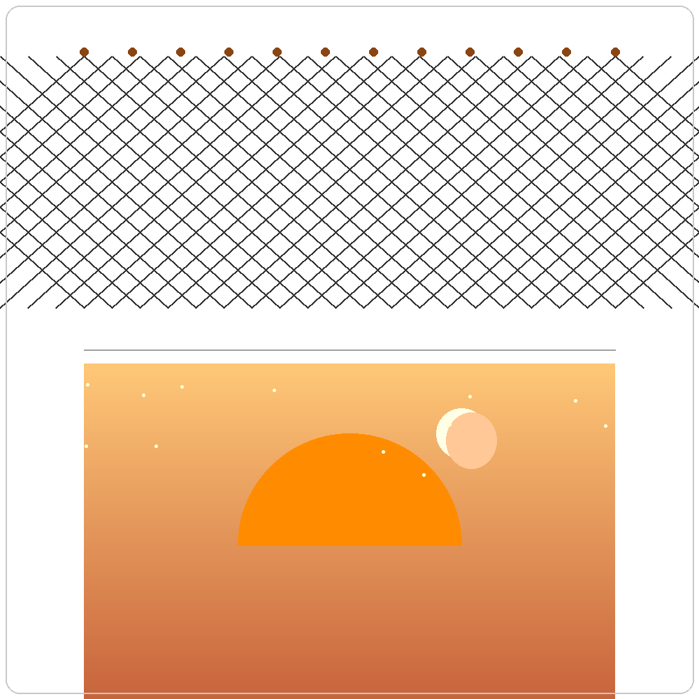

# 千字谜子题 274

## 题面

## 答案

`罗`

## 解析

画面上半部分为交织的网格状结构，代表“罒”（网）；下半部分为夕阳、月亮和夜空，代表“夕”。将“罒”置于“夕”上方，合成汉字 “罗”

## 本地附件

- [7762655c13f04417b7c962a436571466.webp](../../../assets/static.cipherpuzzles.com/static/images/7762655c13f04417b7c962a436571466.webp)

来源：[https://ccbc16.cipherpuzzles.com/data/c16-qian-puzzle.json#cid=274](https://ccbc16.cipherpuzzles.com/data/c16-qian-puzzle.json#cid=274)
