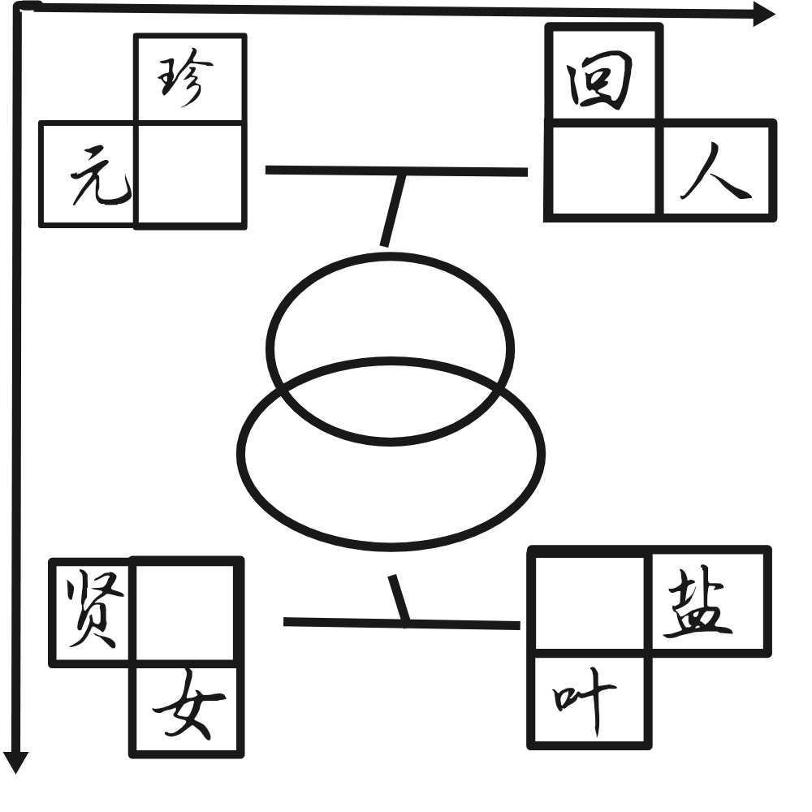

# 千字谜子题 275

## 题面

## 答案

`寂`

## 解析

四角组词填入字，图片边的箭头是阅读方向，按照阅读方向组的词分别为：珍宝、元宝、回家、家人、贤淑、淑女、椒盐、椒叶。所以四角填入的字左到右上到下分别为：宝、家、淑、椒。提取连线字的公共部首，最后在圆圈上下拼接，得到答案“寂”

## 本地附件

- [95aaf2e3c2094c6aabf1f92847ced142.webp](../../../assets/static.cipherpuzzles.com/static/images/95aaf2e3c2094c6aabf1f92847ced142.webp)

来源：[https://ccbc16.cipherpuzzles.com/data/c16-qian-puzzle.json#cid=275](https://ccbc16.cipherpuzzles.com/data/c16-qian-puzzle.json#cid=275)
