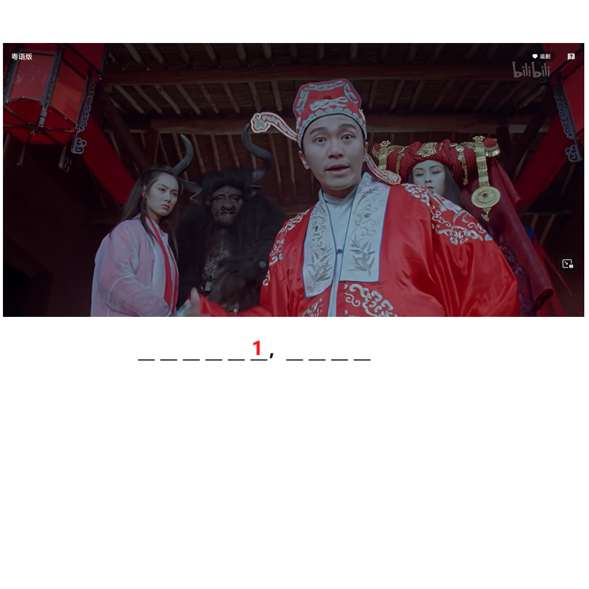

# 千字谜子题 276

## 题面

## 答案

`貌`

## 解析

梗图 来自电影《大话西游之大圣娶亲》
我反对这门亲事！
人家郎才女貌，天生一对
轮到你这妖怪来反对？

## 本地附件

- [7605b8fbdeab43a7a639fbdc3a1ea43b.webp](../../../assets/static.cipherpuzzles.com/static/images/7605b8fbdeab43a7a639fbdc3a1ea43b.webp)

来源：[https://ccbc16.cipherpuzzles.com/data/c16-qian-puzzle.json#cid=276](https://ccbc16.cipherpuzzles.com/data/c16-qian-puzzle.json#cid=276)
