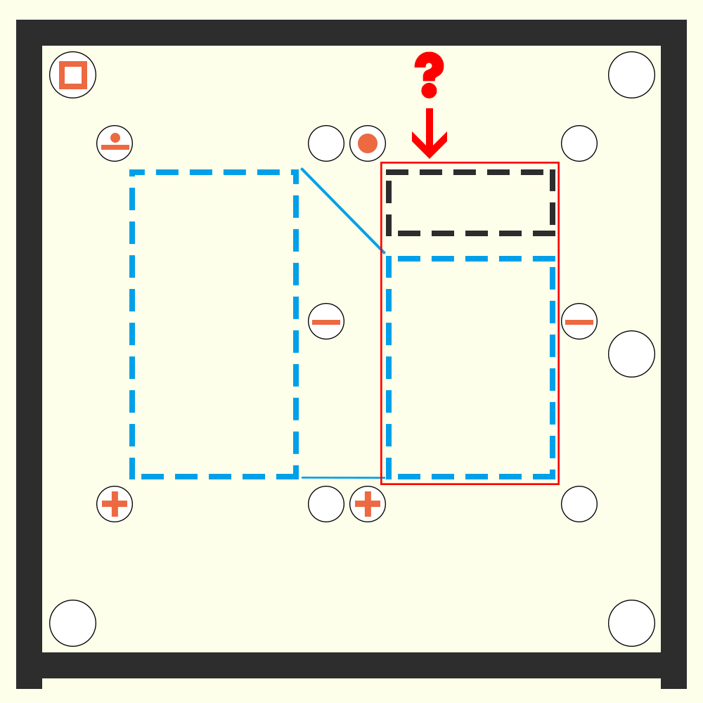

# 千字谜子题 278

## 题面

## 答案

`宰`

## 解析

用四角号码来解读。
“四角+右中的5个圈”出现了三组，是形式提示；最外围的方框（“口”字）是示例，其四角码为60000，因为仅包含左上读出的方框（6）一个部件。
画面中间的两个字，右字为上下结构，左字为其下半部分。
按四角号码规则解读，左字四角码为0（点下有横），0，4（十字叉），0，1（横）= 00401，查询可得符合条件的有斊、辛两个字。
右字四角码为3（点），0，4（十字叉），0，1（横）= 30401， 查询可得符合条件的有凖、宇、宰、準、穻五个字。
结合结构提示，可知符合要求的只有辛&宰一对字。

## 本地附件

- [20cb2a3b3b354308b2b4a0dd81b9d884.webp](../../../assets/static.cipherpuzzles.com/static/images/20cb2a3b3b354308b2b4a0dd81b9d884.webp)

来源：[https://ccbc16.cipherpuzzles.com/data/c16-qian-puzzle.json#cid=278](https://ccbc16.cipherpuzzles.com/data/c16-qian-puzzle.json#cid=278)
