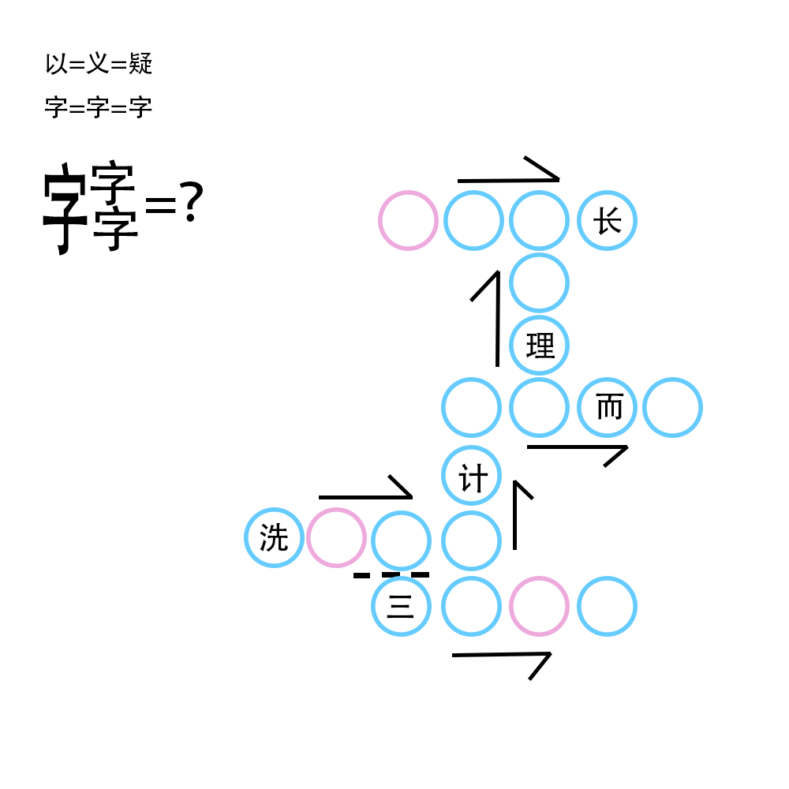

# 千字谜子题 279

## 题面

## 答案

`阮`

## 解析

以 (yi3) 义 (yi4) 疑 (yi2) 提示三个字的拼音去掉音调之后相同。
成语填空的结果（按照每个成语左上角的位置，从上到下，从左到右）为：「儿女情长」「天理人情」「从天而降」「言听计从」「洗耳恭听」「三言两语」。
粉色框内的「耳」「二」「儿」符合拼音相同。
按照左边三个「字」的排列顺序，并把「耳」转化为「阝」，可以得到「阮」。

## 本地附件

- [e79aea0a4913493bb38121b21d3947da.webp](../../../assets/static.cipherpuzzles.com/static/images/e79aea0a4913493bb38121b21d3947da.webp)

来源：[https://ccbc16.cipherpuzzles.com/data/c16-qian-puzzle.json#cid=279](https://ccbc16.cipherpuzzles.com/data/c16-qian-puzzle.json#cid=279)
