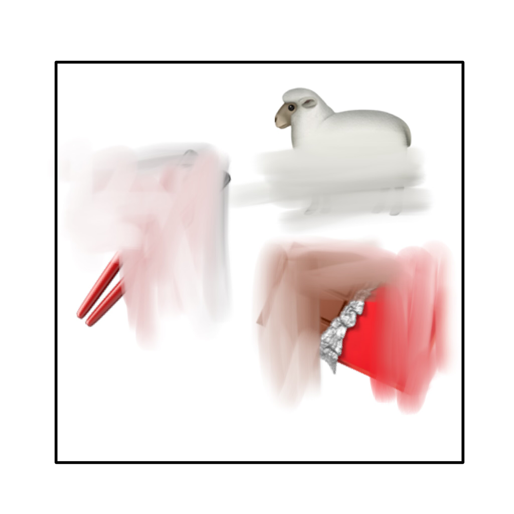

# 千字谜子题 28

## 题面

## 答案

`悦`

## 解析

取"筷"的竖心旁、"羊"的倒八头、巧克力中"克"的兄，即可拼接成"悦"字。

## 本地附件

- [0e6f4e5f4ba34ebaa7417b868f8dc488.webp](../../../assets/static.cipherpuzzles.com/static/images/0e6f4e5f4ba34ebaa7417b868f8dc488.webp)

来源：[https://ccbc16.cipherpuzzles.com/data/c16-qian-puzzle.json#cid=28](https://ccbc16.cipherpuzzles.com/data/c16-qian-puzzle.json#cid=28)
