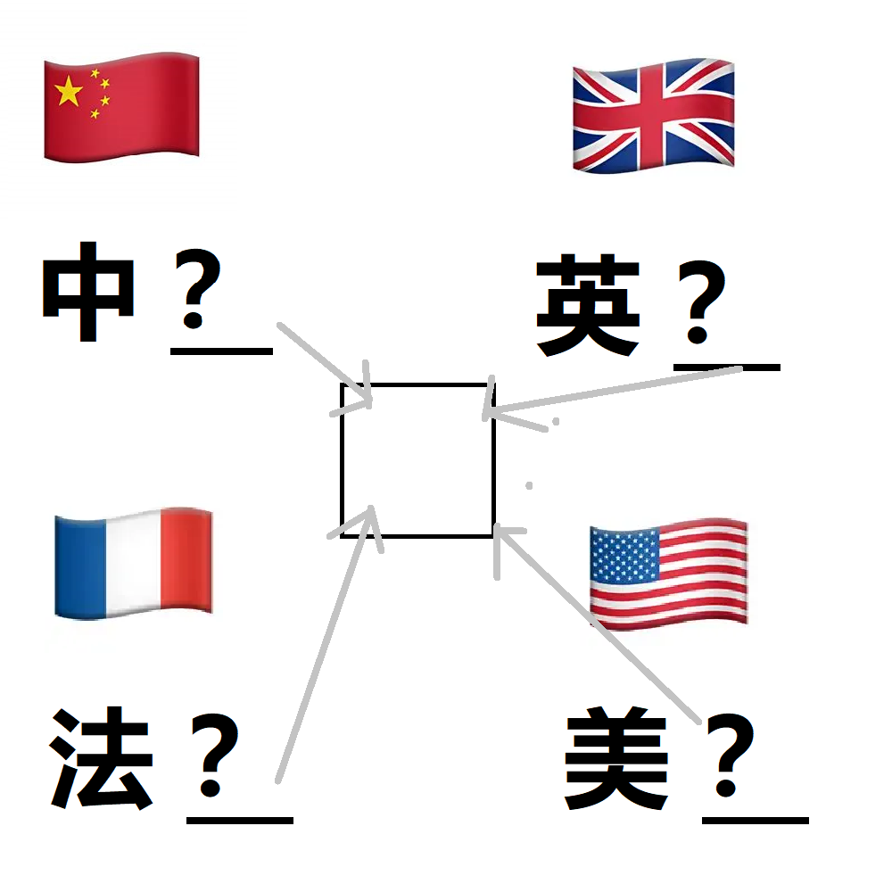

# 千字谜子题 280

## 题面

## 答案

`国`

## 解析

显然
4个？处均可填“国”，都指向一个框，表示同一单字
答案为“国”

## 本地附件

- [ae10ed75b5154197a141dd819a25bd88.webp](../../../assets/static.cipherpuzzles.com/static/images/ae10ed75b5154197a141dd819a25bd88.webp)

来源：[https://ccbc16.cipherpuzzles.com/data/c16-qian-puzzle.json#cid=280](https://ccbc16.cipherpuzzles.com/data/c16-qian-puzzle.json#cid=280)
