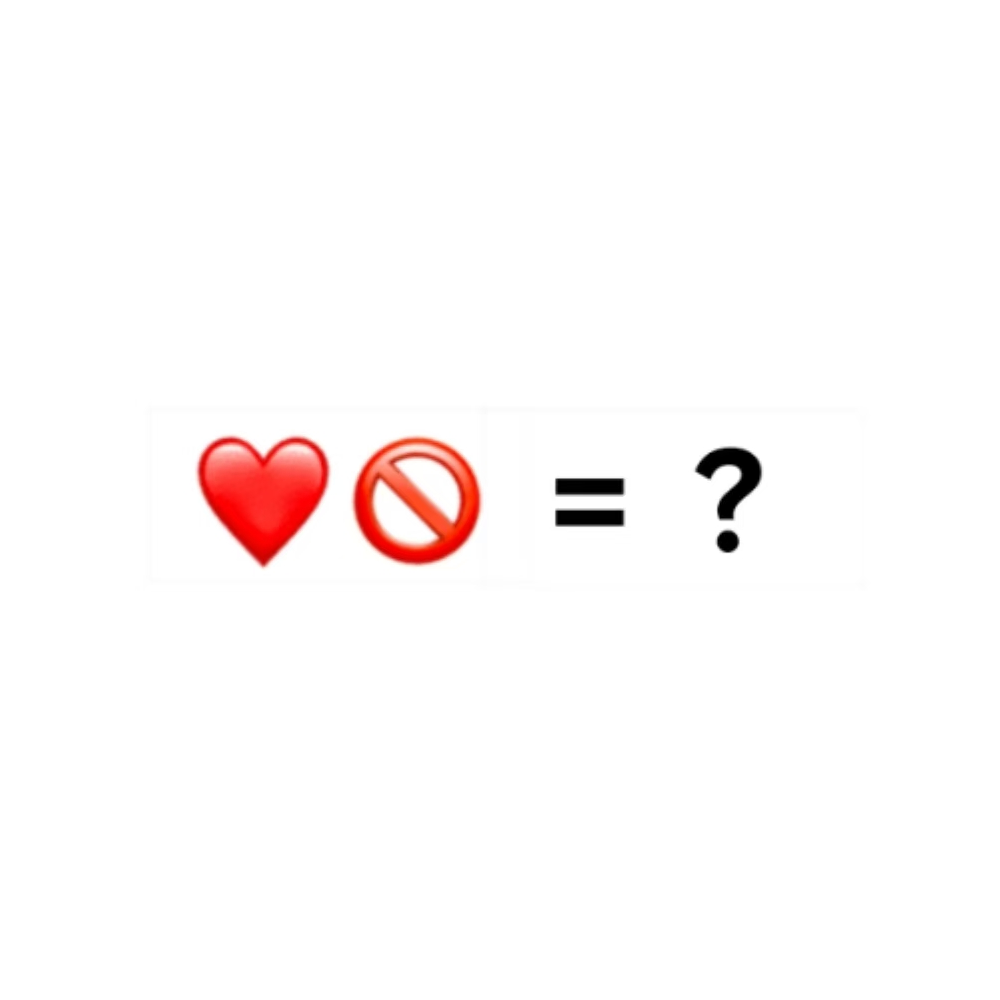

# 千字谜子题 281

## 题面

## 答案

`怀`

## 解析

两个emoji表情分别是“心”和“不”，组成了“怀”。

## 本地附件

- [f2e349bfd3ae44bb8c175de7317cf618.webp](../../../assets/static.cipherpuzzles.com/static/images/f2e349bfd3ae44bb8c175de7317cf618.webp)

来源：[https://ccbc16.cipherpuzzles.com/data/c16-qian-puzzle.json#cid=281](https://ccbc16.cipherpuzzles.com/data/c16-qian-puzzle.json#cid=281)
