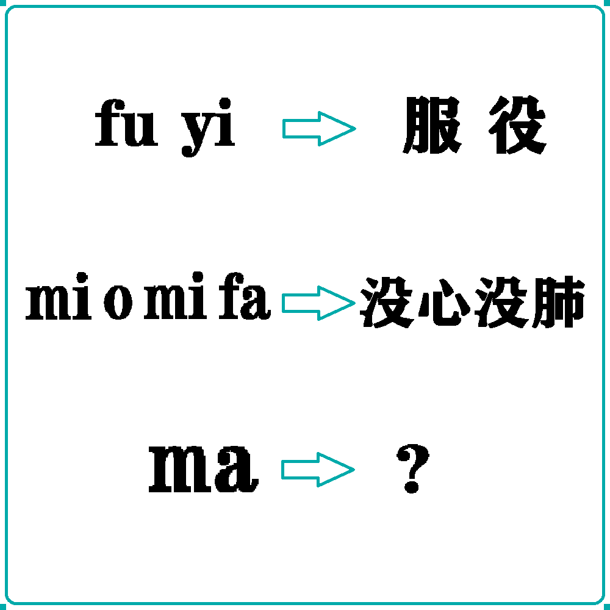

# 千字谜子题 283

## 题面

## 答案

`沛`

## 解析

上方的每一个字母分别对应了下方汉字的一个部件。
如：f→月，u→𠬝。
因为m→氵，a→巿，
所以ma→沛。
（第二版更改：更换排版，更改词语，稍加装饰）

## 本地附件

- [4e0bb09991eb4d7eb6f6735ec2c2de31.webp](../../../assets/static.cipherpuzzles.com/static/images/4e0bb09991eb4d7eb6f6735ec2c2de31.webp)

来源：[https://ccbc16.cipherpuzzles.com/data/c16-qian-puzzle.json#cid=283](https://ccbc16.cipherpuzzles.com/data/c16-qian-puzzle.json#cid=283)
