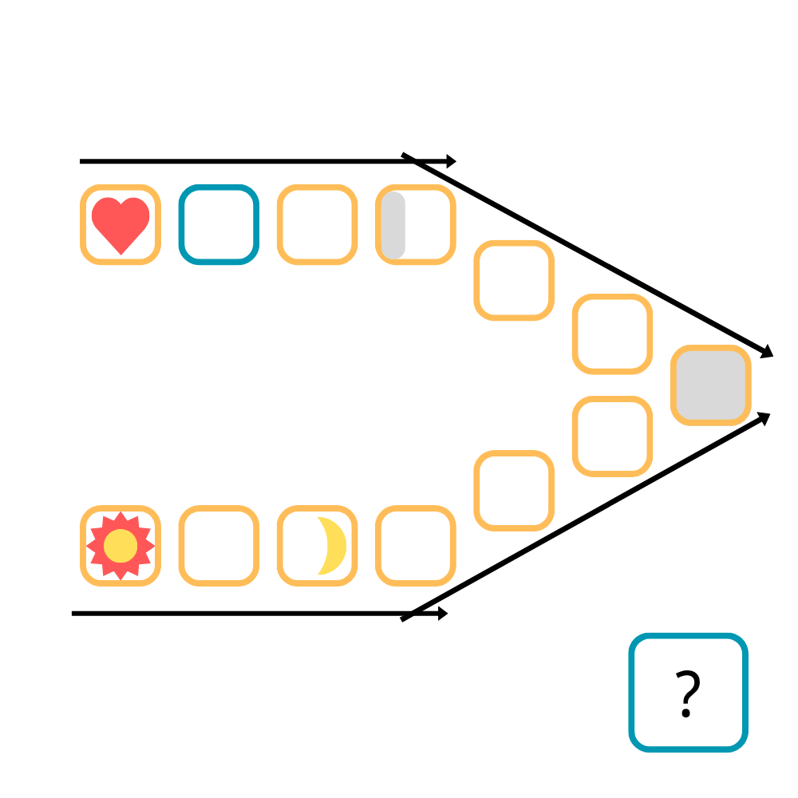

# 千字谜子题 284

## 题面

## 答案

`灵`

## 解析

心灵手巧，巧夺天工；日新月异，异曲同工。
猜成语题目。
突破点在两个灰色字。上面的灰色部分是弧线边框，说明是灰色代表的字整体而非左半部分。根据其它几个条件应该可以对出来“巧夺天工”。
其实只留上半部分也足够了，不过那样投机性太大了。

## 本地附件

- [f33479fe7c5c4713a37ac13fd8f978b9.webp](../../../assets/static.cipherpuzzles.com/static/images/f33479fe7c5c4713a37ac13fd8f978b9.webp)

来源：[https://ccbc16.cipherpuzzles.com/data/c16-qian-puzzle.json#cid=284](https://ccbc16.cipherpuzzles.com/data/c16-qian-puzzle.json#cid=284)
