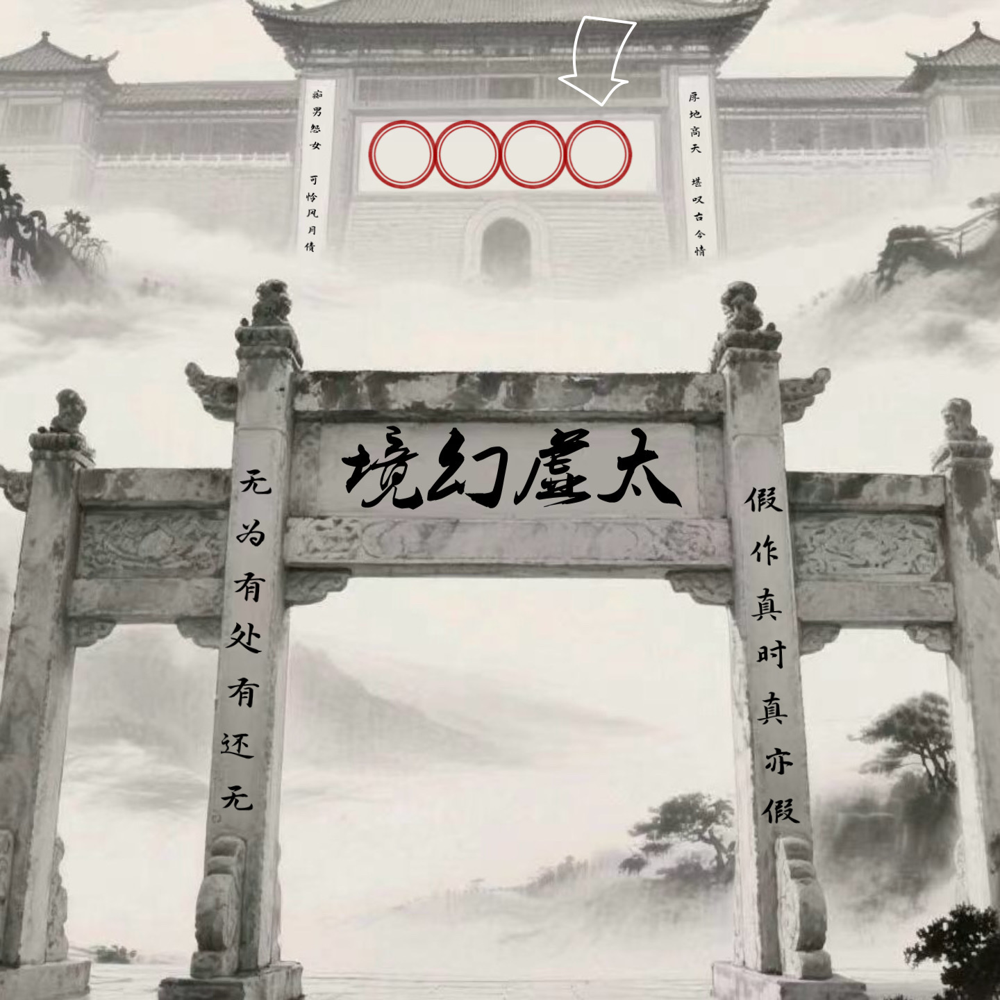

# 千字谜子题 285

## 题面

## 答案

`孽`

## 解析

《红楼梦》第五回：
有石牌横建，上书“太虚幻境”四个大字，两边一副对联，乃是：
假作真时真亦假，无为有处有还无。
转过牌坊，便是一座宫门，上面横书四个大字，道是：“孽海情天”。又有一副对联，大书云：
厚地高天，堪叹古今情不尽；痴男怨女，可怜风月债难偿。

## 本地附件

- [820afc72ff1348d39218ebf276d5f268.webp](../../../assets/static.cipherpuzzles.com/static/images/820afc72ff1348d39218ebf276d5f268.webp)

来源：[https://ccbc16.cipherpuzzles.com/data/c16-qian-puzzle.json#cid=285](https://ccbc16.cipherpuzzles.com/data/c16-qian-puzzle.json#cid=285)
