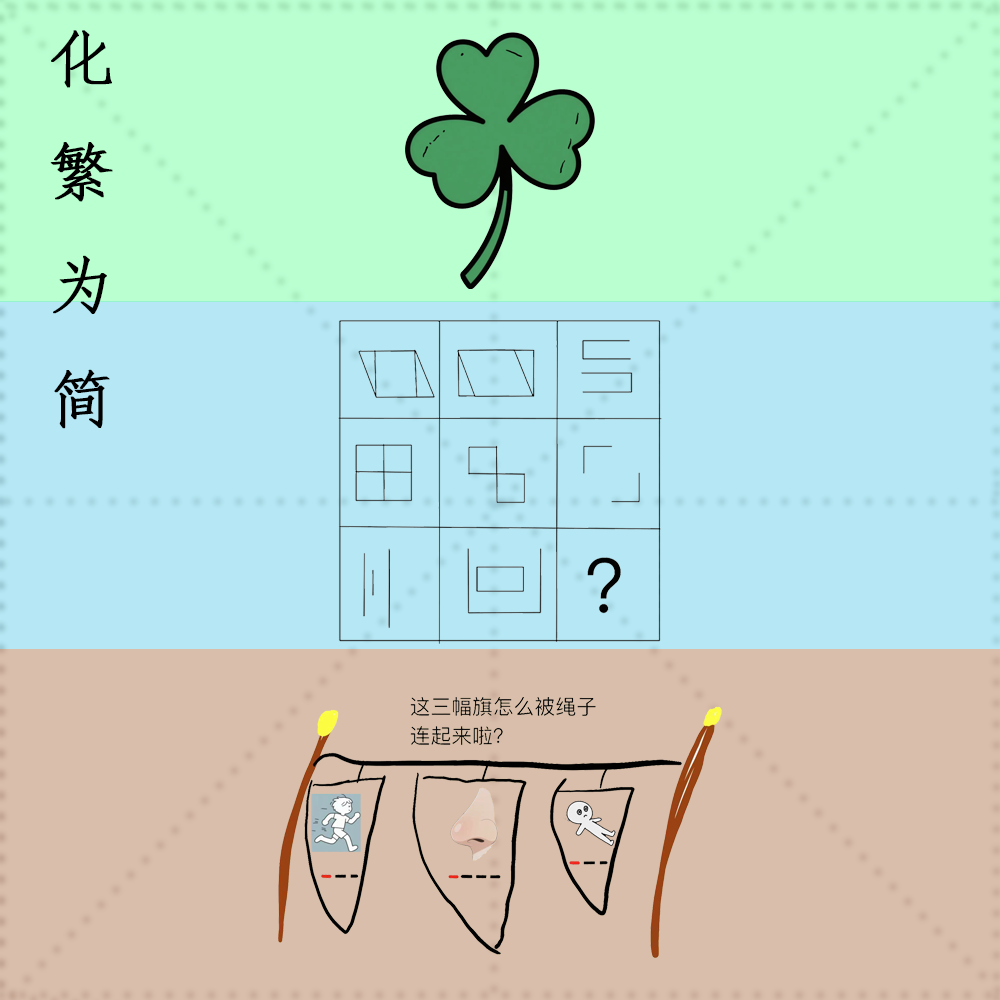

# 千字谜子题 287

## 题面

## 答案

`叶`

## 解析

背景米字格明示汉字，上中下三色表示三部分，上边的三叶草叶片中，摩斯密码可得到cao，结合颜色及图画可猜出“草”，中间部分每一行前两幅图去同存异并旋转可得到第三幅图，问号处可得到“世”，下边的三幅图分别为run、nose、die，提取标红字母可得到“rnd”结合图画及提示可联想到旗语，将其相连为“木”。最终得到上中下三个部分为“草世木”由于草位于汉字顶部偏旁部首位置仅取“艹”组合得到“葉”，根据题目“化繁为简”得到其简体字“叶”

## 本地附件

- [1f101fb0c7bb450caad4b850f155cb5d.webp](../../../assets/static.cipherpuzzles.com/static/images/1f101fb0c7bb450caad4b850f155cb5d.webp)

来源：[https://ccbc16.cipherpuzzles.com/data/c16-qian-puzzle.json#cid=287](https://ccbc16.cipherpuzzles.com/data/c16-qian-puzzle.json#cid=287)
