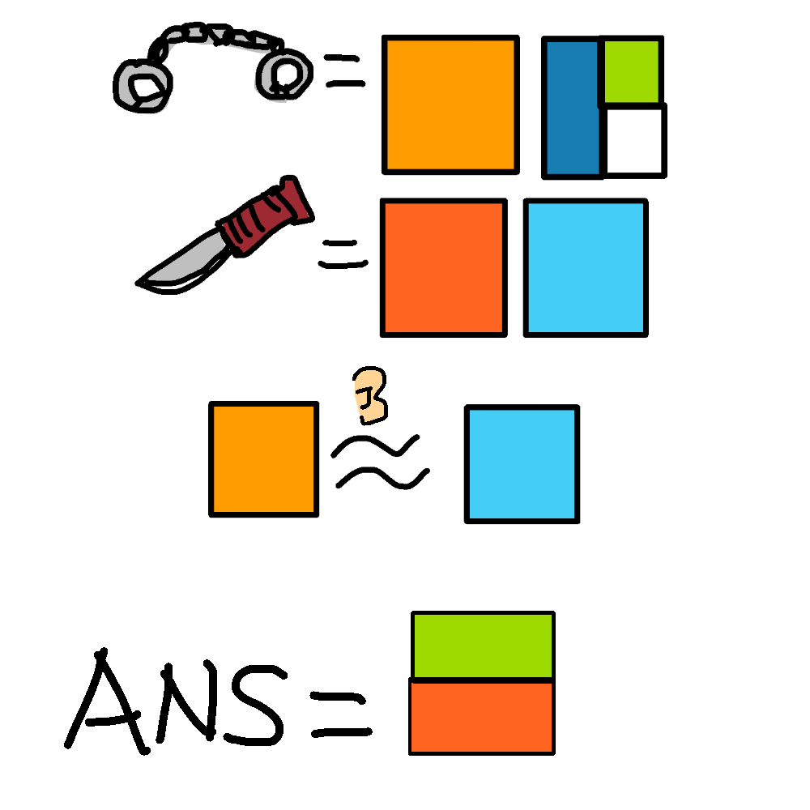

# 千字谜子题 288

## 题面

## 答案

`老`

## 解析

根据图像信息可得，所给之物分别为手铐和匕首。第三行线索中耳朵图标意味着两个字谐音。根据相同颜色对应相应汉字组件，可得最终答案为“老”（不会美工）

## 本地附件

- [5c6adabc89854a27b5a147de1d12b01f.webp](../../../assets/static.cipherpuzzles.com/static/images/5c6adabc89854a27b5a147de1d12b01f.webp)

来源：[https://ccbc16.cipherpuzzles.com/data/c16-qian-puzzle.json#cid=288](https://ccbc16.cipherpuzzles.com/data/c16-qian-puzzle.json#cid=288)
