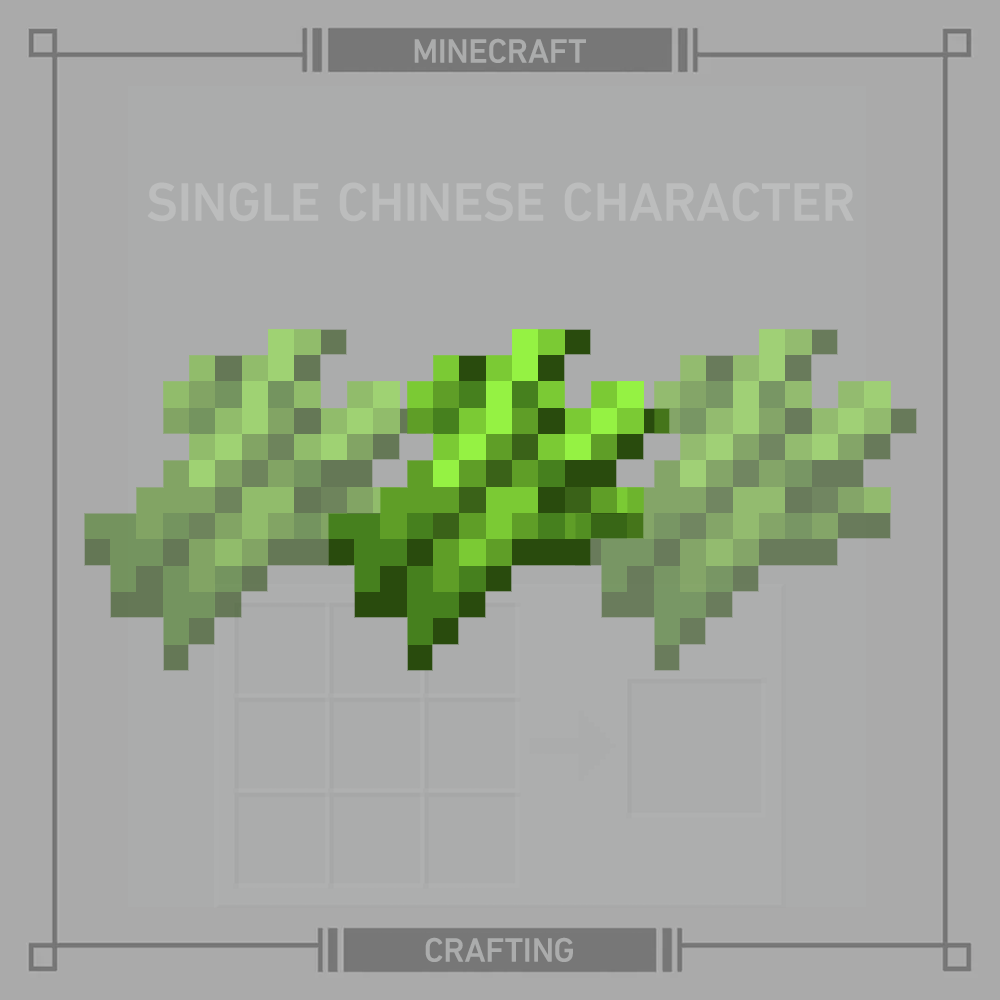

# 千字谜子题 289

## 题面

## 答案

`纸`

## 解析

题目解析：图中有MINECRAFT CRAFTING字样、游戏物品合成台UI（透明度5%），指示题目为游戏《Minecraft》相关内容，识图图片元素后发现是游戏中的甘蔗物品。访问游戏Wiki网站《Sugar Cane》一节后可以在用途一节发现三个甘蔗可以合成纸，SINGLE CHINESE CHARACTER表明答案为单个中文字，答案即为"纸"。

## 本地附件

- [ccbdfe42aaa14627a8677d5ef3a5a2b7.webp](../../../assets/static.cipherpuzzles.com/static/images/ccbdfe42aaa14627a8677d5ef3a5a2b7.webp)

来源：[https://ccbc16.cipherpuzzles.com/data/c16-qian-puzzle.json#cid=289](https://ccbc16.cipherpuzzles.com/data/c16-qian-puzzle.json#cid=289)
