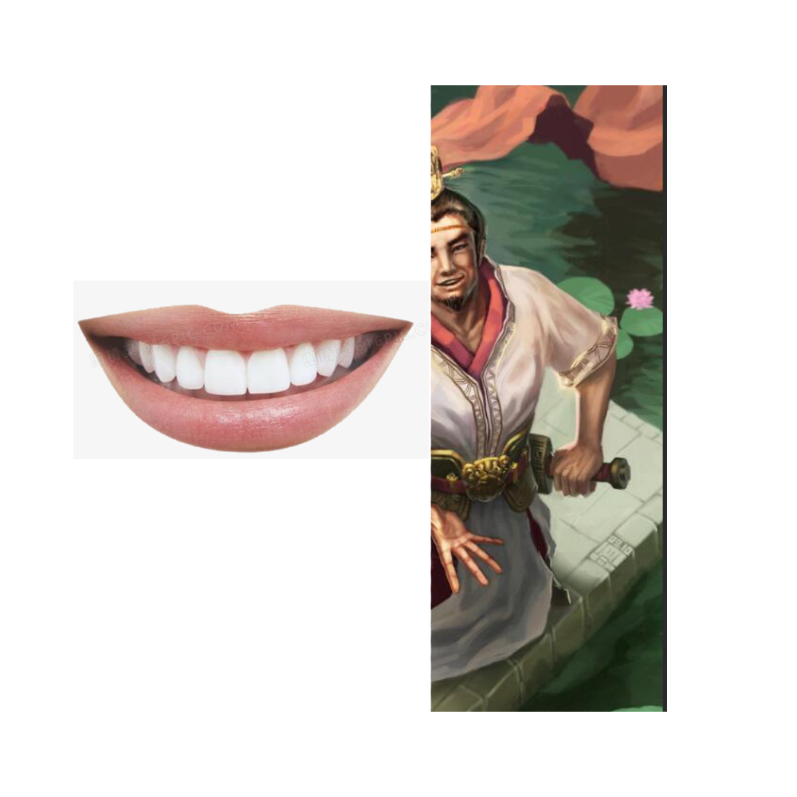

# 千字谜子题 29

## 题面

## 答案

`啸`

## 解析

口+（鲁）肃

蒸蒸日上

## 本地附件

- [7f286e8b2cd04e129e7bc96de9a4c795.webp](../../../assets/static.cipherpuzzles.com/static/images/7f286e8b2cd04e129e7bc96de9a4c795.webp)

来源：[https://ccbc16.cipherpuzzles.com/data/c16-qian-puzzle.json#cid=29](https://ccbc16.cipherpuzzles.com/data/c16-qian-puzzle.json#cid=29)
