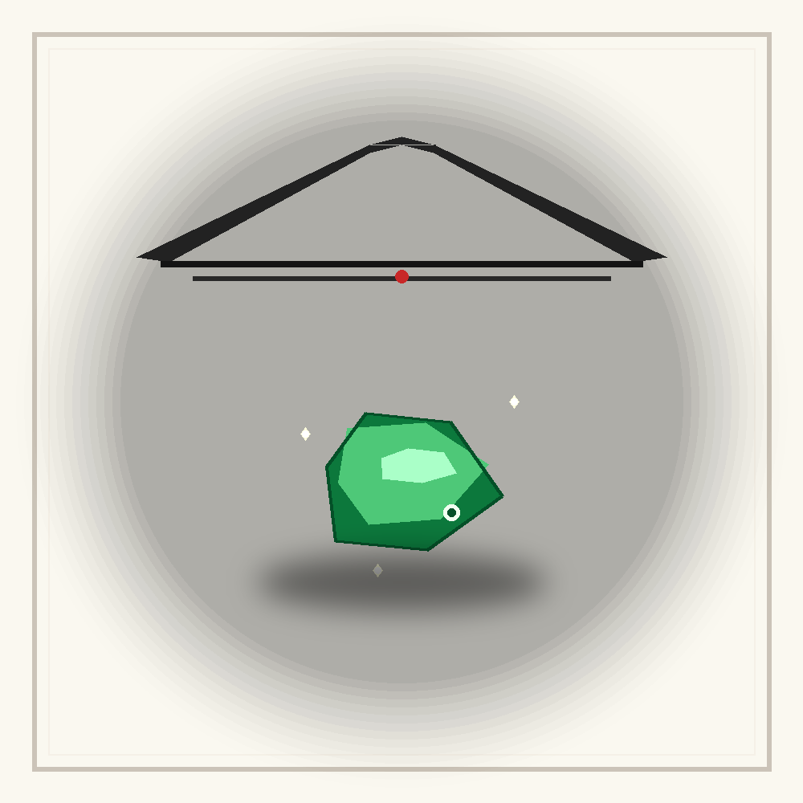

# 千字谜子题 292

## 题面

## 答案

`宝`

## 解析

此图谜用图形重构汉字构件，答案为 “宝”。
上方是一个简化的屋顶造型，指代汉字的宀部（“宝”字上方的部首）。
屋顶下方为一块绿色的玉／宝石（用多层色块和高光表现），对应汉字的“玉”部分（表示玉器、珍宝、宝物）。图中在宝石旁还放了一个细小的亮点（暗示“玉”字中的小点）。
合在一起，屋顶（宀）罩在玉（玉）上，正好构成汉字“宝”的会意结构（宀 + 玉 → 宝），因此答案为 “宝”。

## 本地附件

- [ab80aeddc3ff4a84a2f1864f573edc78.webp](../../../assets/static.cipherpuzzles.com/static/images/ab80aeddc3ff4a84a2f1864f573edc78.webp)

来源：[https://ccbc16.cipherpuzzles.com/data/c16-qian-puzzle.json#cid=292](https://ccbc16.cipherpuzzles.com/data/c16-qian-puzzle.json#cid=292)
