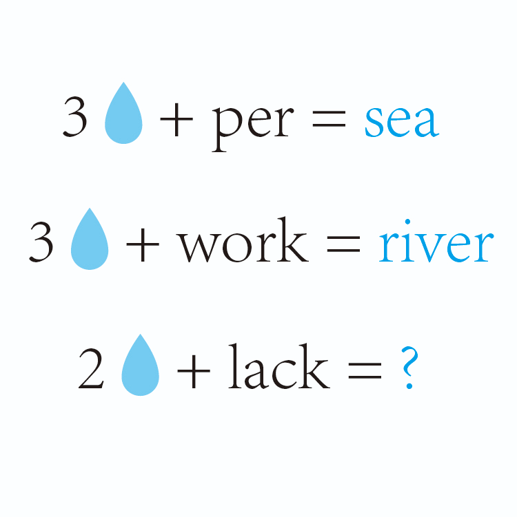

# 千字谜子题 293

## 题面

## 答案

`次`

## 解析

“3💧”代表三点水 (⺡)，“per”翻译为“每”,⺡+每就是“海”(sea);
“2💧”代表两点水 (⺡)，“work”翻译为“工”，⺡+工就是“江”(river);
“2💧”代表两点水 (⼎)，“lack”翻译为“欠”，⼎+欠就是“次”;所以正确答案是“次”。

## 本地附件

- [d9b3ff90054846f3867a2359c8e31ae0.webp](../../../assets/static.cipherpuzzles.com/static/images/d9b3ff90054846f3867a2359c8e31ae0.webp)

来源：[https://ccbc16.cipherpuzzles.com/data/c16-qian-puzzle.json#cid=293](https://ccbc16.cipherpuzzles.com/data/c16-qian-puzzle.json#cid=293)
