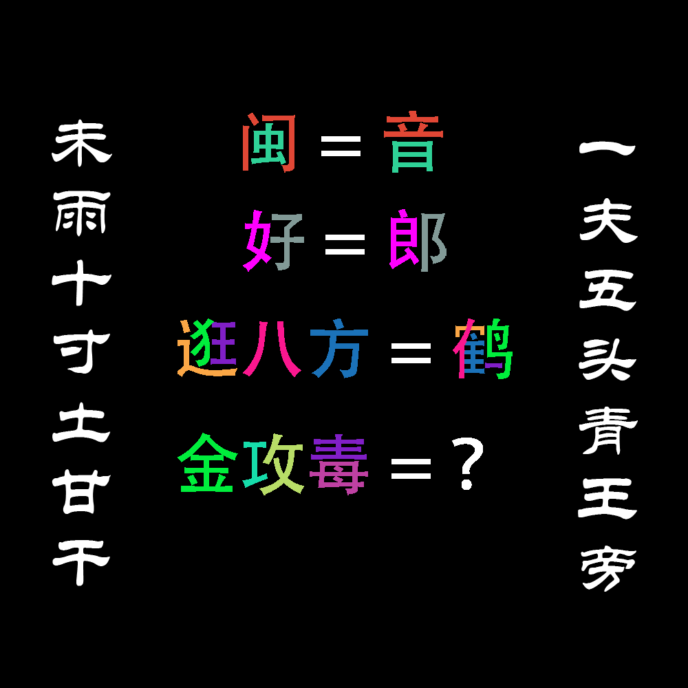

# 千字谜子题 295

## 题面

## 答案

`绕`

## 解析

题目左右两连为五笔98版字根表GF两区的文字重排（以区分之与五笔86版），由此入手，容易发现这就是一个简单的五笔拆字谜，其中前三行也给了充足的验证信息：闽、音都是UJ；好、郎都是BV；而逛八方按照颜色匹配PQGWY五个部件，经历重排得到一字为鹤（正好又有奇特的语义联系）；最后一行按照部件拆字得到QATXG，这五个字母在五笔98版中经过不充分验证，能打出来的组合是XATQ，即绕字。

## 本地附件

- [0c838ee78883404a87db48e63ee6e9c5.webp](../../../assets/static.cipherpuzzles.com/static/images/0c838ee78883404a87db48e63ee6e9c5.webp)

来源：[https://ccbc16.cipherpuzzles.com/data/c16-qian-puzzle.json#cid=295](https://ccbc16.cipherpuzzles.com/data/c16-qian-puzzle.json#cid=295)
