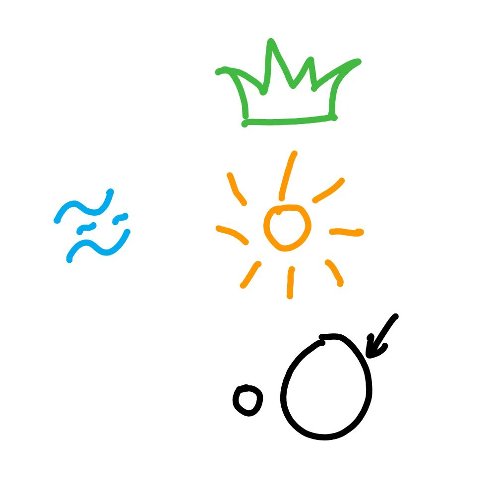

# 千字谜子题 296

## 题面

## 答案

`漠`

## 解析

从左到右从上到下依次是水（三点水）、草（草字头）、日、大

## 本地附件

- [80d67aad06b1494bbcefb5eaf883ade0.webp](../../../assets/static.cipherpuzzles.com/static/images/80d67aad06b1494bbcefb5eaf883ade0.webp)

来源：[https://ccbc16.cipherpuzzles.com/data/c16-qian-puzzle.json#cid=296](https://ccbc16.cipherpuzzles.com/data/c16-qian-puzzle.json#cid=296)
