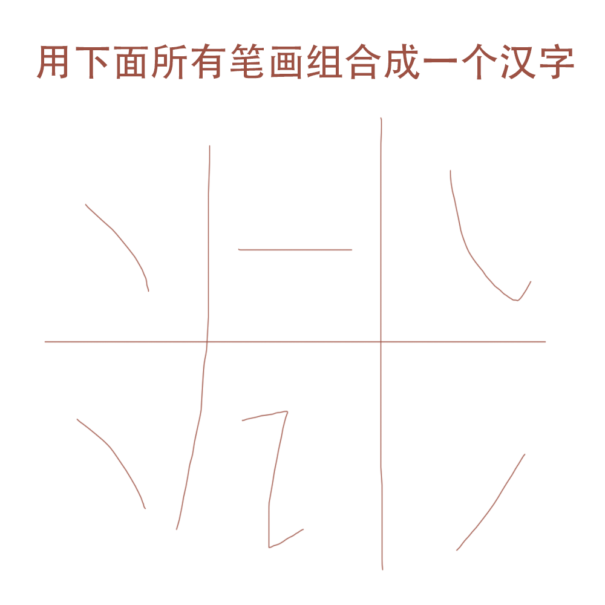

# 千字谜子题 297

## 题面

## 答案

`诫`

## 解析

就狡猾的把字的一部分隐藏作分隔框。

## 本地附件

- [b00a0a90d21343d1be5cb9f06b772c90.webp](../../../assets/static.cipherpuzzles.com/static/images/b00a0a90d21343d1be5cb9f06b772c90.webp)

来源：[https://ccbc16.cipherpuzzles.com/data/c16-qian-puzzle.json#cid=297](https://ccbc16.cipherpuzzles.com/data/c16-qian-puzzle.json#cid=297)
