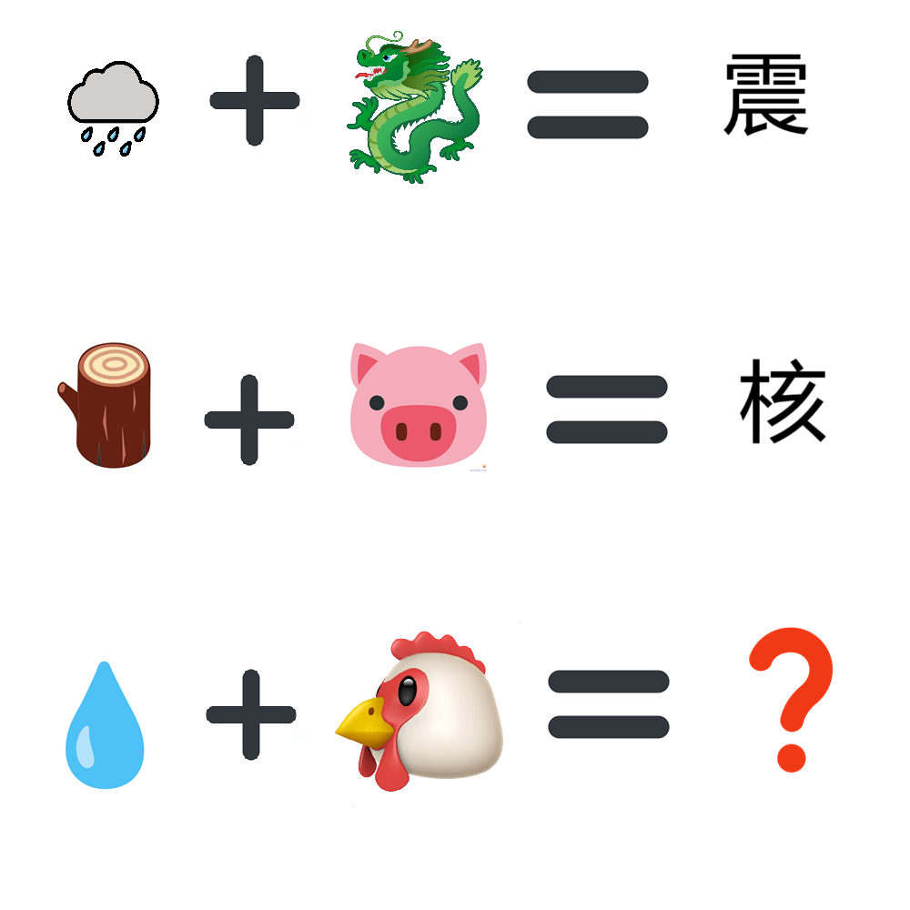

# 千字谜子题 298

## 题面

## 答案

`酒`

## 解析

龙-->辰龙-->辰， 辰+雨 = 震
猪 --> 亥猪 --> 亥， 木+亥 = 核
鸡 --> 酉鸡 --> 酉， 水+酉 = 酒
故答案是酒

## 本地附件

- [5c17b71a3f5440609491550b58e27608.webp](../../../assets/static.cipherpuzzles.com/static/images/5c17b71a3f5440609491550b58e27608.webp)

来源：[https://ccbc16.cipherpuzzles.com/data/c16-qian-puzzle.json#cid=298](https://ccbc16.cipherpuzzles.com/data/c16-qian-puzzle.json#cid=298)
