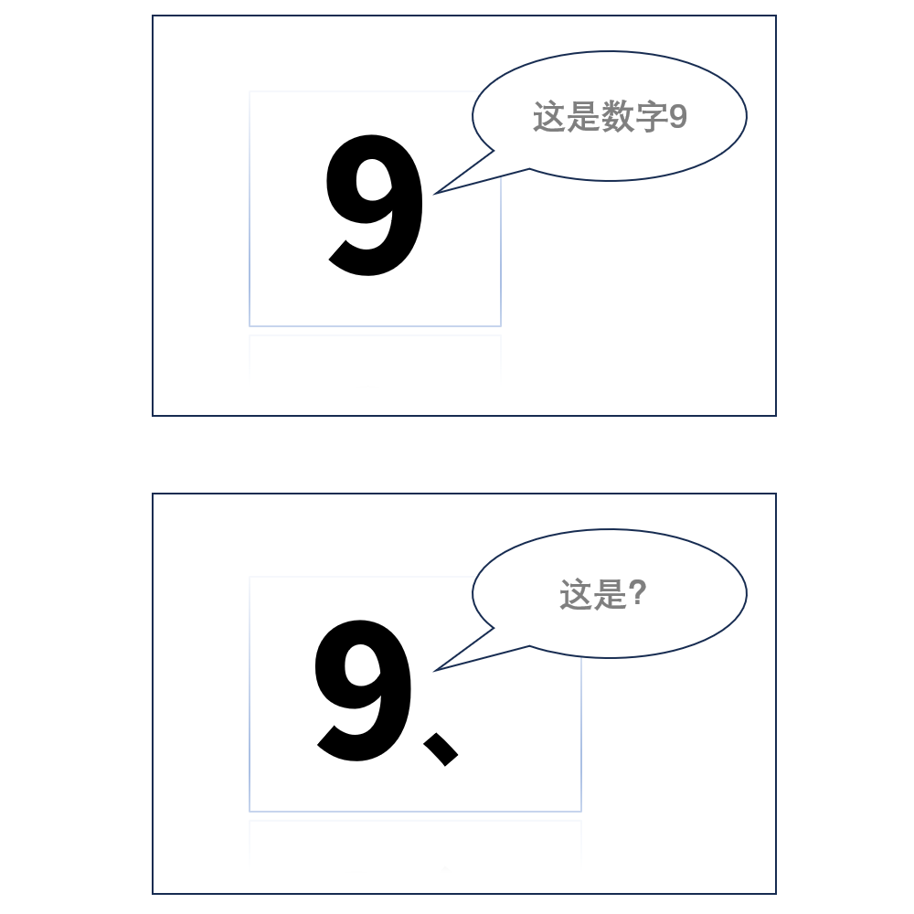

# 千字谜子题 299

## 题面

## 答案

`丸`

## 解析

这是一道内容简短的速度争先类的谜题，适用于微信群里的争先类活动。题面的上半部提示此题与“9”相关。题面的下半部“这是？”暗示答案为一个汉字或者字符。需要将“9”从阿拉伯数字形式转化成汉字形式“九”，并与后面的点“、”进行组字。最终获得答案“丸”。

## 本地附件

- [2292d3f3116a4fb1a15f14b20463f1f4.webp](../../../assets/static.cipherpuzzles.com/static/images/2292d3f3116a4fb1a15f14b20463f1f4.webp)

来源：[https://ccbc16.cipherpuzzles.com/data/c16-qian-puzzle.json#cid=299](https://ccbc16.cipherpuzzles.com/data/c16-qian-puzzle.json#cid=299)
