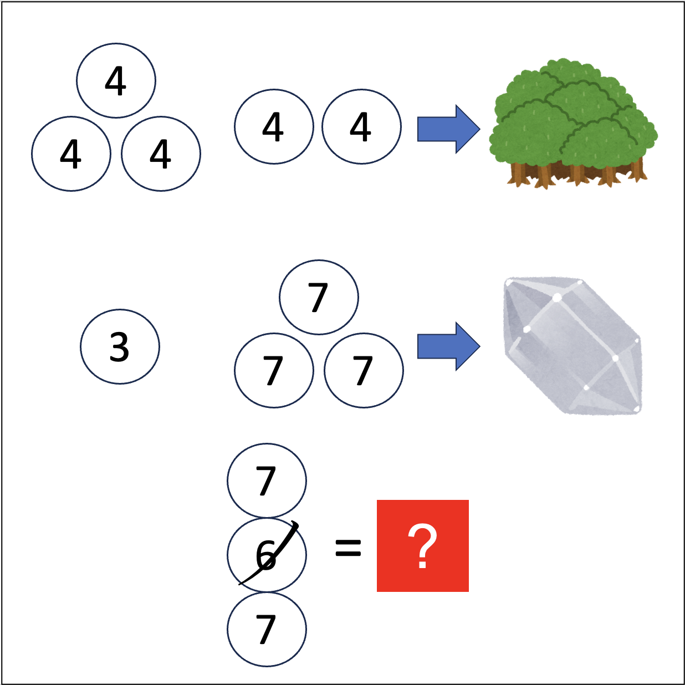

# 千字谜子题 30

## 题面

## 答案

`暑`

## 解析

第一張圖可以看出來是森林，可以得到4是木
第二張圖可以看出來是水晶，可以得到3是水，7是日
綜合得到1~7是七曜
因此6是土 得到最終答案是「暑」

## 本地附件

- [d90f779c0e1f478abedfe3349d36e3b0.webp](../../../assets/static.cipherpuzzles.com/static/images/d90f779c0e1f478abedfe3349d36e3b0.webp)

来源：[https://ccbc16.cipherpuzzles.com/data/c16-qian-puzzle.json#cid=30](https://ccbc16.cipherpuzzles.com/data/c16-qian-puzzle.json#cid=30)
