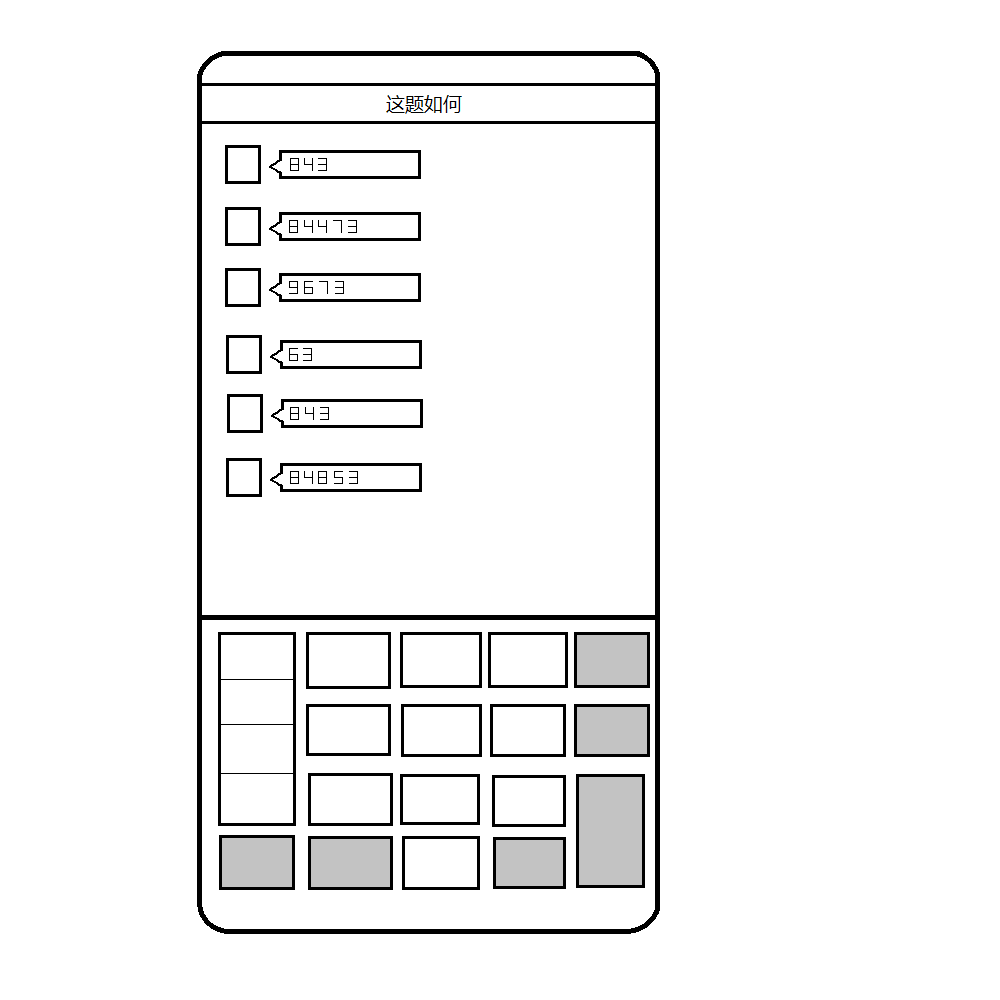

# 千字谜子题 302

## 题面

## 答案

`如`

## 解析

图上是九键输入法，用手机九键输入法输入图上数字，可以得到英文the third word of the title，即题目“这题如何”的第三个字“如”

## 本地附件

- [b34039602b344d06a5d656c0f83ca290.webp](../../../assets/static.cipherpuzzles.com/static/images/b34039602b344d06a5d656c0f83ca290.webp)

来源：[https://ccbc16.cipherpuzzles.com/data/c16-qian-puzzle.json#cid=302](https://ccbc16.cipherpuzzles.com/data/c16-qian-puzzle.json#cid=302)
