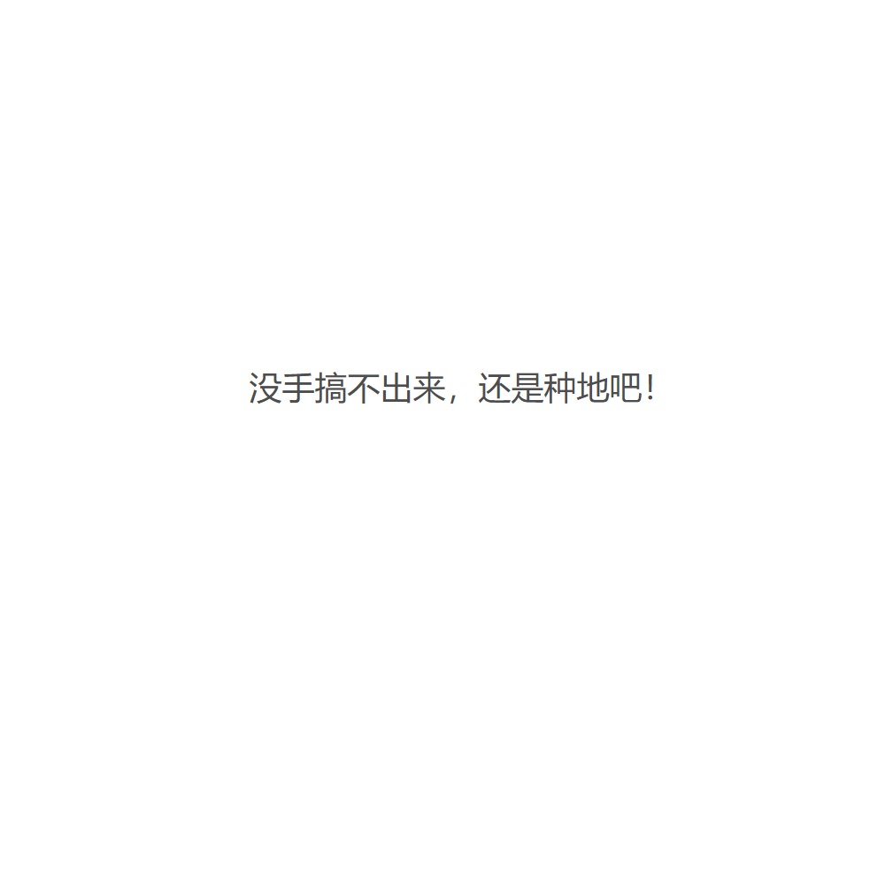

# 千字谜子题 304

## 题面

## 答案

`稿`

## 解析

搞-手+禾=稿

## 本地附件

- [40136e65b8924803bfd76ef02955e553.webp](../../../assets/static.cipherpuzzles.com/static/images/40136e65b8924803bfd76ef02955e553.webp)

来源：[https://ccbc16.cipherpuzzles.com/data/c16-qian-puzzle.json#cid=304](https://ccbc16.cipherpuzzles.com/data/c16-qian-puzzle.json#cid=304)
