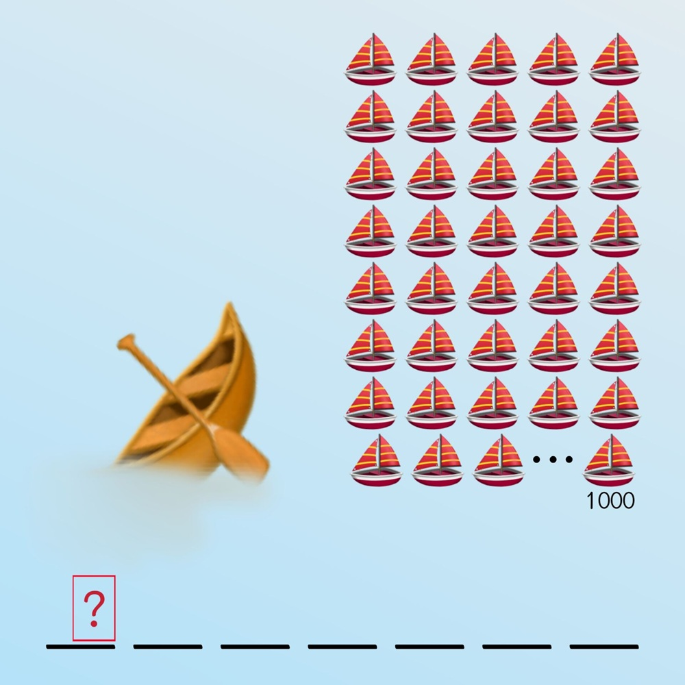

# 千字谜子题 305

## 题面

## 答案

`冗`

## 解析

画面信息对应诗句【沉舟侧畔千帆过】，提取【沉】的右半，即为【冗】

## 本地附件

- [24bcc9729c594405bbcfc69ed9a4fd12.webp](../../../assets/static.cipherpuzzles.com/static/images/24bcc9729c594405bbcfc69ed9a4fd12.webp)

来源：[https://ccbc16.cipherpuzzles.com/data/c16-qian-puzzle.json#cid=305](https://ccbc16.cipherpuzzles.com/data/c16-qian-puzzle.json#cid=305)
