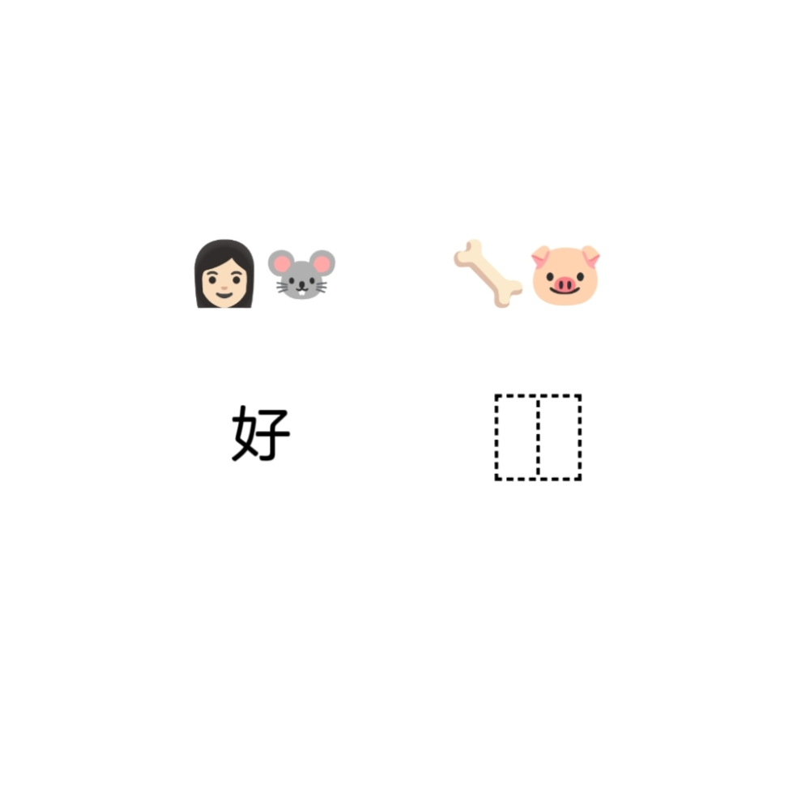

# 千字谜子题 308

## 题面

## 答案

`骸`

## 解析

对照左侧示例可知答案是左右结构的汉字，左侧是emoji对应的事物，右侧是动物对应的地支，骨加亥得骸。

## 本地附件

- [dee5ede5d67f469b8af646042323d8b4.webp](../../../assets/static.cipherpuzzles.com/static/images/dee5ede5d67f469b8af646042323d8b4.webp)

来源：[https://ccbc16.cipherpuzzles.com/data/c16-qian-puzzle.json#cid=308](https://ccbc16.cipherpuzzles.com/data/c16-qian-puzzle.json#cid=308)
