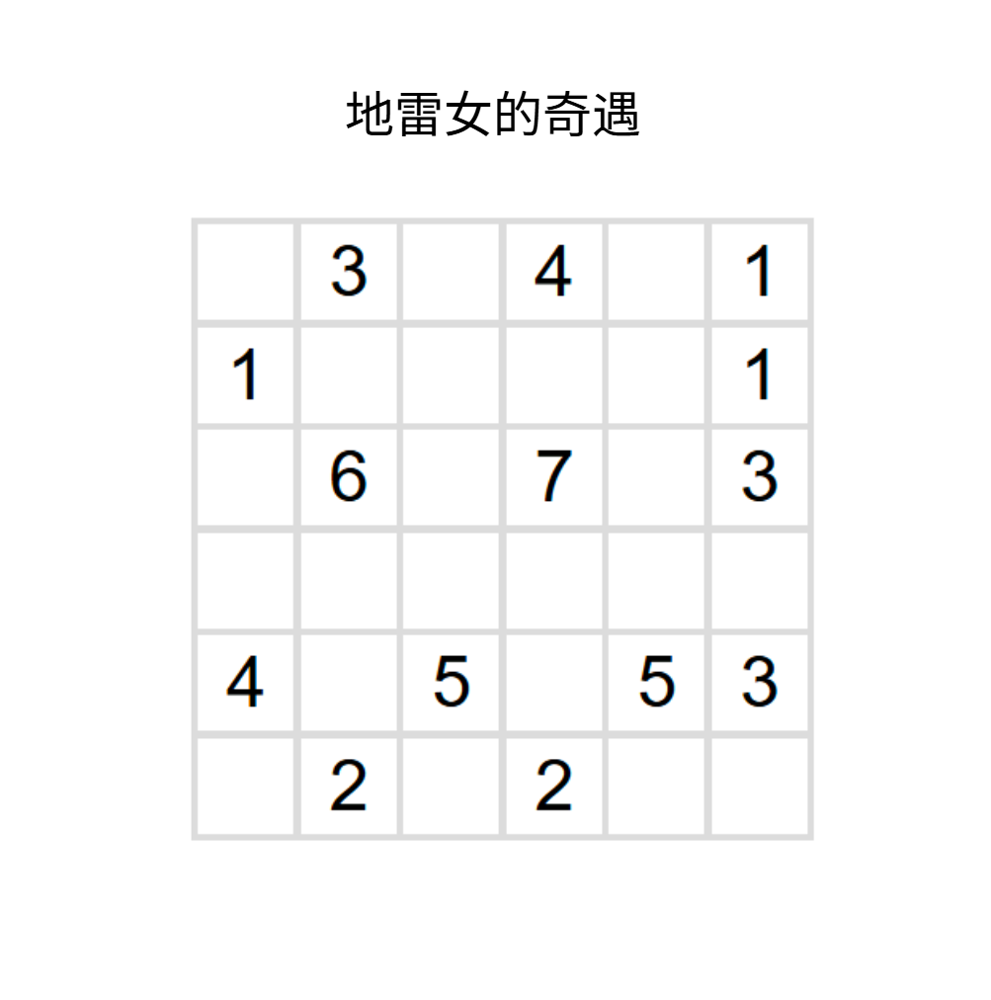
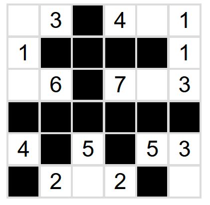

# 千字谜子题 31

## 题面

## 答案

`夫`

## 解析

## 本地附件

- [image.png](../../../assets/p.sda1.dev/26/83ba0d417afa876c6753515c29ecdc22/image.png)
- [9b1a74dadcb749898f65d38c36fdffad.webp](../../../assets/static.cipherpuzzles.com/static/images/9b1a74dadcb749898f65d38c36fdffad.webp)

来源：[https://ccbc16.cipherpuzzles.com/data/c16-qian-puzzle.json#cid=31](https://ccbc16.cipherpuzzles.com/data/c16-qian-puzzle.json#cid=31)
