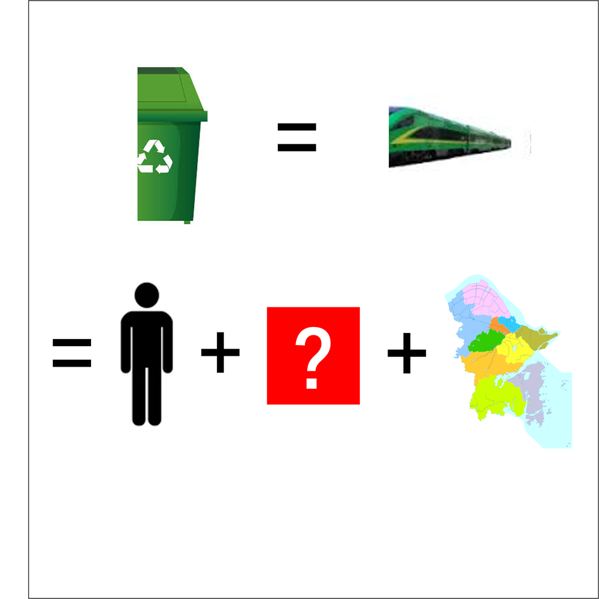

# 千字谜子题 311

## 题面

## 答案

`及`

## 解析

上面两张图片的含义是“垃圾桶”（CR200J又称垃圾桶），同时图片均被切去了左半边，代表“立及甬”，与下面图片分别对应（站立的人，宁波简称甬），因此问号处的答案是“及”

## 本地附件

- [b8150c65942e4714a2f90521c13b99d8.webp](../../../assets/static.cipherpuzzles.com/static/images/b8150c65942e4714a2f90521c13b99d8.webp)

来源：[https://ccbc16.cipherpuzzles.com/data/c16-qian-puzzle.json#cid=311](https://ccbc16.cipherpuzzles.com/data/c16-qian-puzzle.json#cid=311)
