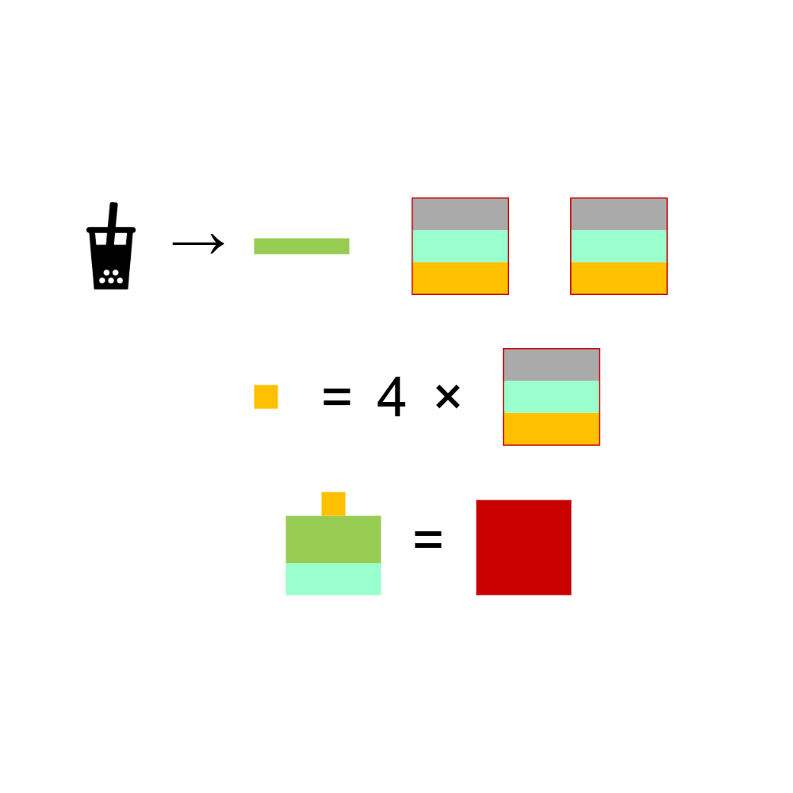

# 千字谜子题 312

## 题面

## 答案

`言`

## 解析

根据图片可以获得基础信息：
饮料、ABB结构，字形结构。
结合小黄色=4×字，可综合推断前者是“点”这一笔画，后者是“点”这个字；饮料指的即为奶茶，也就是“一点点”；绿色的即为“一”
将“点”字根据上中下的方式拆分，可得中间为“口”
将笔画“点”，三个“一”，一个“口”按图片组合即可得到最终答案“言”

*使用的饮料图案为免费素材
*使用的工具是draw.io

## 本地附件

- [b742b984ed3f4a0d9f4d200de0680a0a.webp](../../../assets/static.cipherpuzzles.com/static/images/b742b984ed3f4a0d9f4d200de0680a0a.webp)

来源：[https://ccbc16.cipherpuzzles.com/data/c16-qian-puzzle.json#cid=312](https://ccbc16.cipherpuzzles.com/data/c16-qian-puzzle.json#cid=312)
