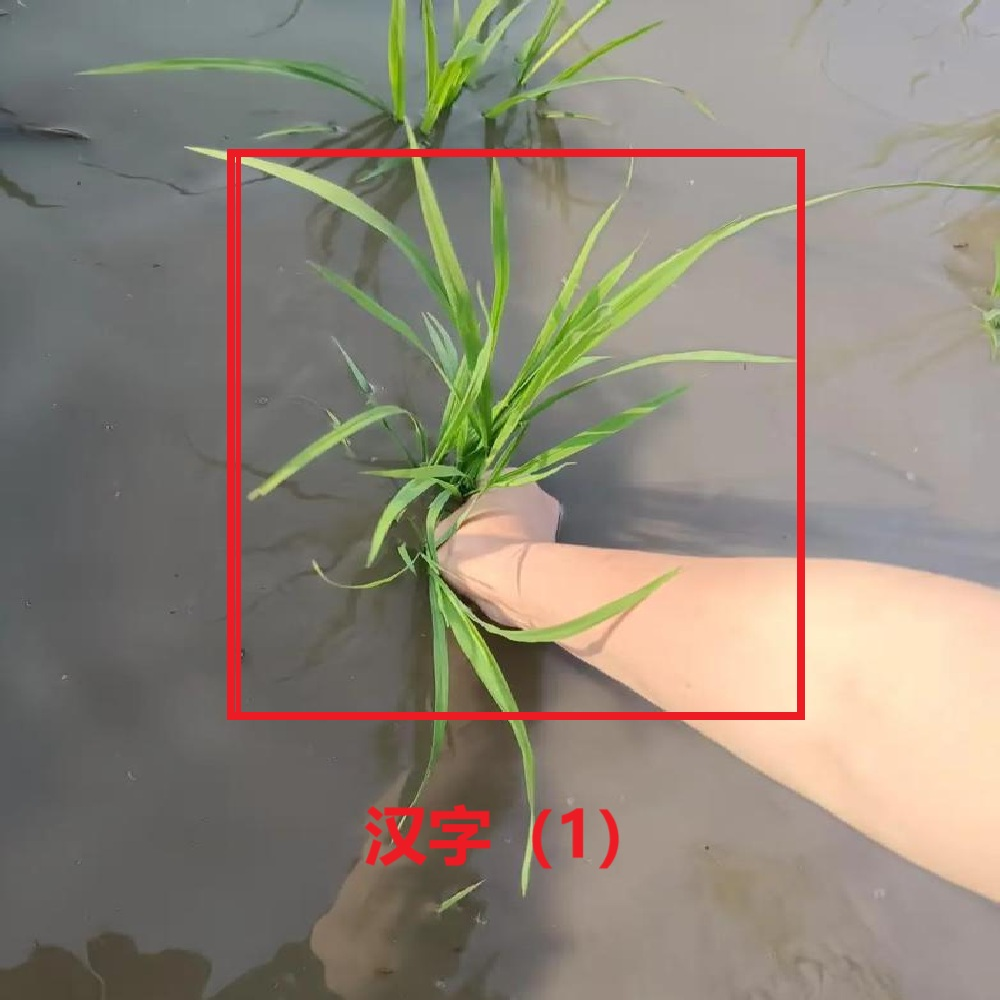

# 千字谜子题 316

## 题面

## 答案

`秉`

## 解析

手抓禾苗，形为秉，“‘秉’本义是禾把。又由手拿一把庄稼引申为拿着”（引号内引自百度百科）

## 本地附件

- [6b54e6cfa395488c906e57bf78ff8290.webp](../../../assets/static.cipherpuzzles.com/static/images/6b54e6cfa395488c906e57bf78ff8290.webp)

来源：[https://ccbc16.cipherpuzzles.com/data/c16-qian-puzzle.json#cid=316](https://ccbc16.cipherpuzzles.com/data/c16-qian-puzzle.json#cid=316)
