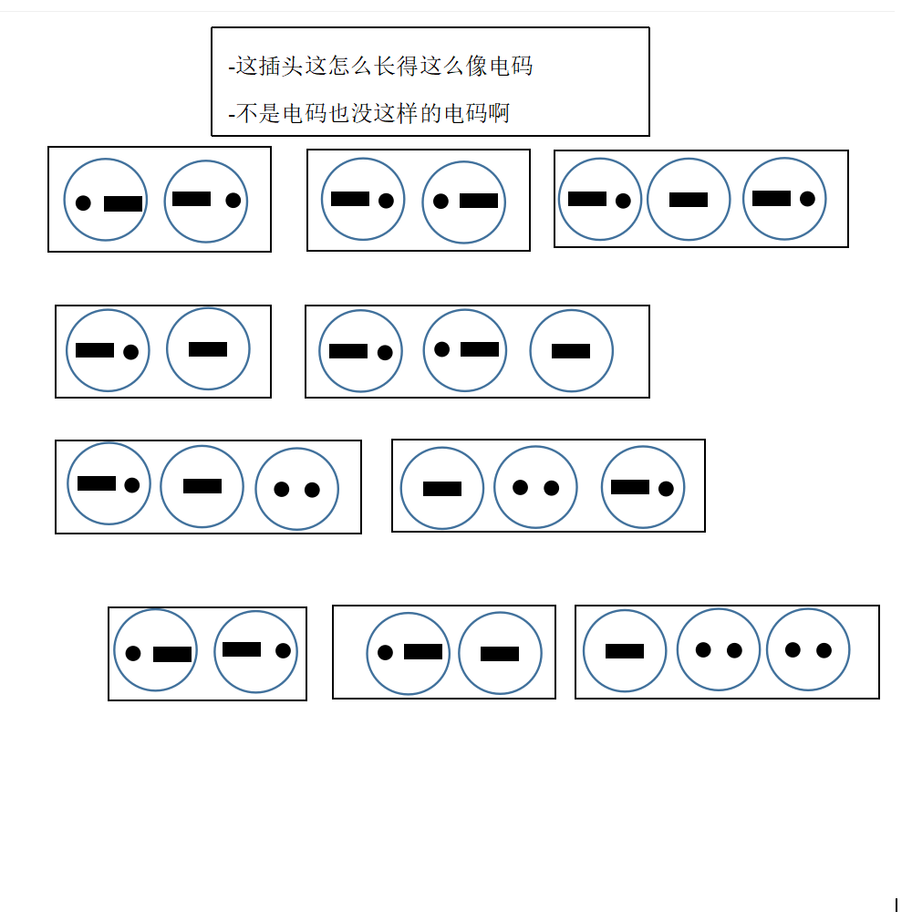

# 千字谜子题 317

## 题面

## 答案

`运`

## 解析

看起来是摩斯电码其实是二进制，换算后解开是6/9/22/5/19/20/18/6/3/16，换算成字母是fivestrfcp，用五笔输入fcp得到运

## 本地附件

- [4ad11e185aad41b1ba2b58cb3ea4096c.webp](../../../assets/static.cipherpuzzles.com/static/images/4ad11e185aad41b1ba2b58cb3ea4096c.webp)

来源：[https://ccbc16.cipherpuzzles.com/data/c16-qian-puzzle.json#cid=317](https://ccbc16.cipherpuzzles.com/data/c16-qian-puzzle.json#cid=317)
