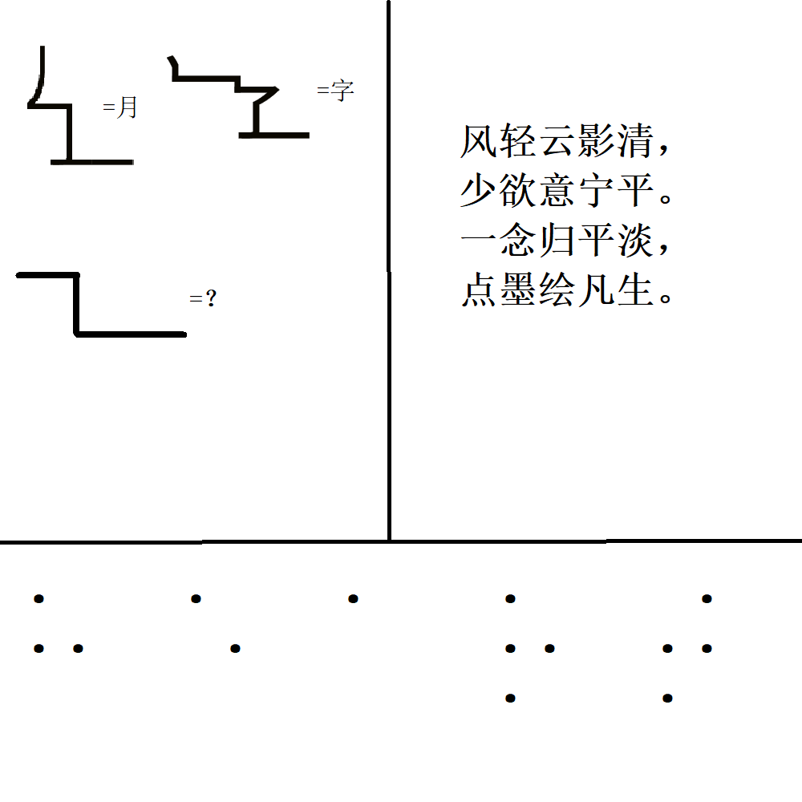

# 千字谜子题 318

## 题面

## 答案

`恐`

## 解析

该谜题由三部分组成，左上角部分为一个汉字的笔画按照笔顺首尾相连得到的“一笔画”及对应汉字，谜底为”工“
右上角为一首藏头诗，将诗每句首字相连，得”风少一点“，即”凡“
下方为单词heart的盲文，即心
三子部分答案按照其在图片的分布位置，组成”恐“字，即最终答案

## 本地附件

- [e8a2573e1a524d09a23579ef0e263ebd.webp](../../../assets/static.cipherpuzzles.com/static/images/e8a2573e1a524d09a23579ef0e263ebd.webp)

来源：[https://ccbc16.cipherpuzzles.com/data/c16-qian-puzzle.json#cid=318](https://ccbc16.cipherpuzzles.com/data/c16-qian-puzzle.json#cid=318)
