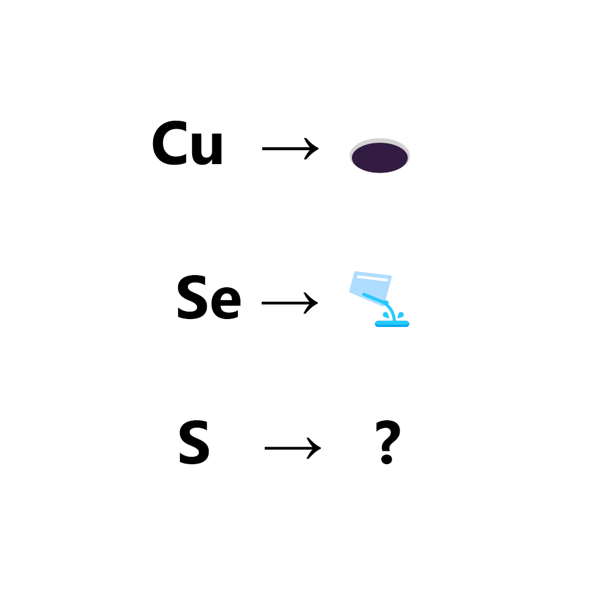

# 千字谜子题 32

## 题面

## 答案

`流`

## 解析

铜->洞，硒->洒，硫->流

## 本地附件

- [925abbf83393458cbef98537e2de866b.webp](../../../assets/static.cipherpuzzles.com/static/images/925abbf83393458cbef98537e2de866b.webp)

来源：[https://ccbc16.cipherpuzzles.com/data/c16-qian-puzzle.json#cid=32](https://ccbc16.cipherpuzzles.com/data/c16-qian-puzzle.json#cid=32)
