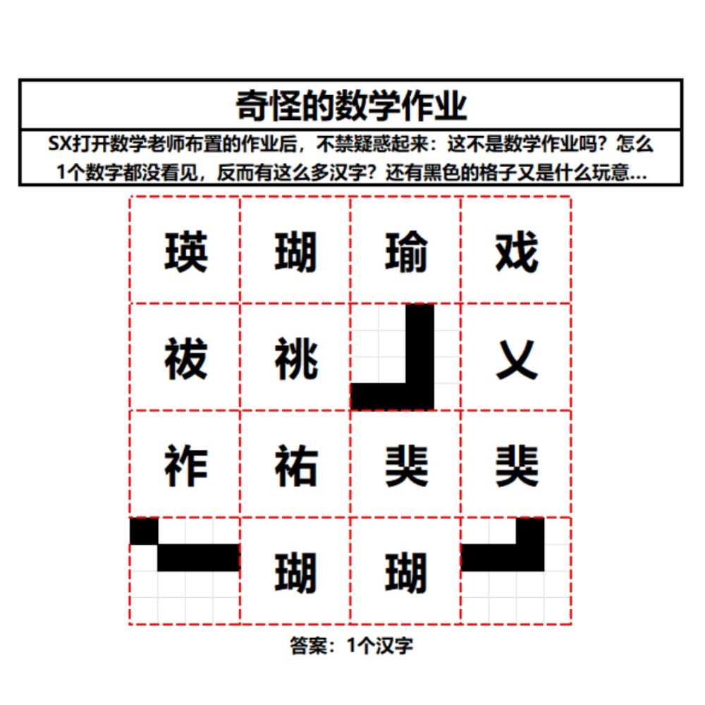

# 千字谜子题 320

## 题面

## 答案

`闰`

## 解析

题目中反复强调数学作业，但却1个数字也没有看到，于是乎我们就会去想怎样才能构造出数字来。中文和数字之间的关系自然会想到中文电码了（特别是题目中包括了一些生僻字）。经过查询转化后，我们就会得到4位的数字啦。接下来看向黑白2种颜色的格子，以及16个格子组成的红色区域。我们可以想想为什么那3个区域并没有给出汉字？或许是数字和汉字之间无法转化？那就有可能是超过4位数了，或者4位数编号无法转化为汉字。黑白容易想到二进制，即01字符串，每个区域都看成1个16位的字符串。注意到，左下角开头就是黑色，将它看作1的话，2^

## 本地附件

- [cecb1acf53e044f5aa2de63d98c81343.webp](../../../assets/static.cipherpuzzles.com/static/images/cecb1acf53e044f5aa2de63d98c81343.webp)

来源：[https://ccbc16.cipherpuzzles.com/data/c16-qian-puzzle.json#cid=320](https://ccbc16.cipherpuzzles.com/data/c16-qian-puzzle.json#cid=320)
