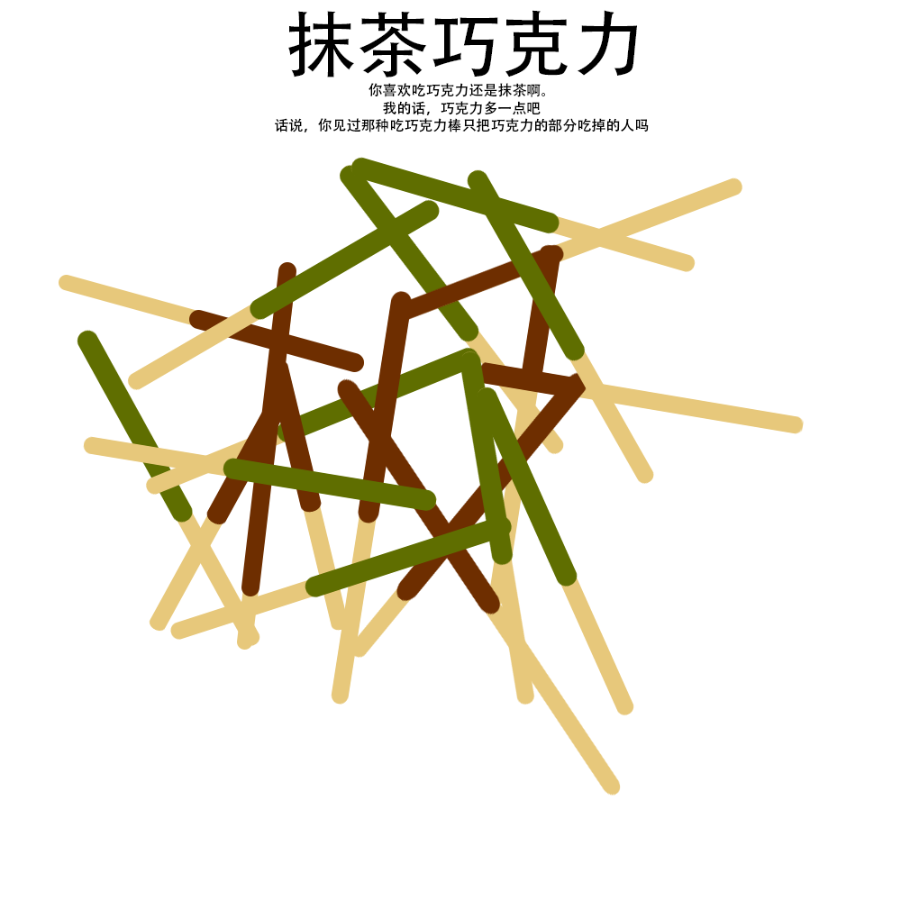

# 千字谜子题 321

## 题面

## 答案

`极`

## 解析

由题干可得巧克力为主要部分且只取巧克力部分，将其余部分去除后可得到巧克力拼成的极字。

## 本地附件

- [988f2c5883f649669608bc0d8b5a2cad.webp](../../../assets/static.cipherpuzzles.com/static/images/988f2c5883f649669608bc0d8b5a2cad.webp)

来源：[https://ccbc16.cipherpuzzles.com/data/c16-qian-puzzle.json#cid=321](https://ccbc16.cipherpuzzles.com/data/c16-qian-puzzle.json#cid=321)
