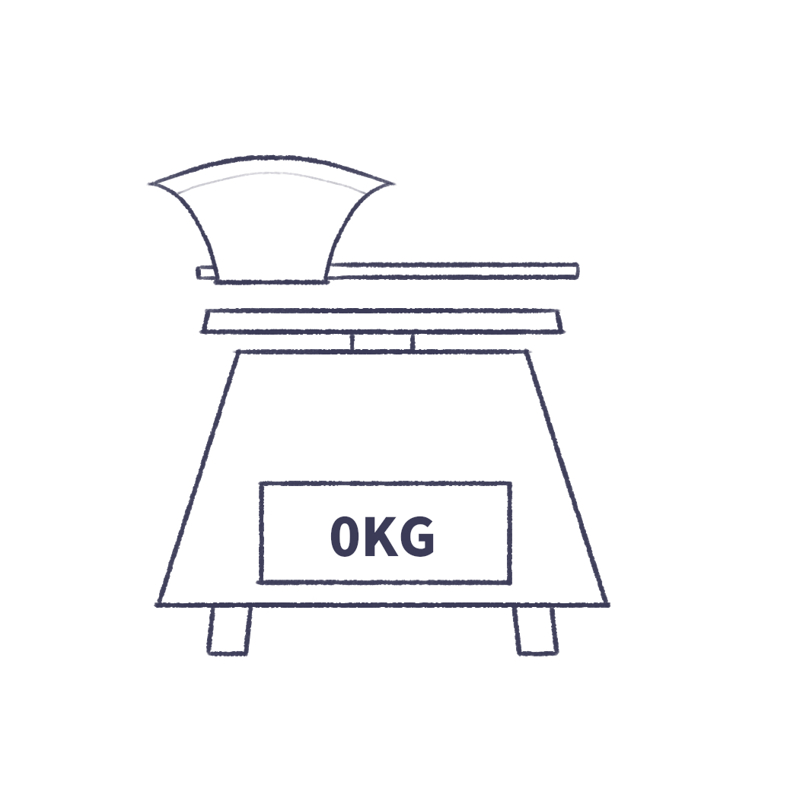

# 千字谜子题 322

## 题面

## 答案

`父`

## 解析

“斧”没有“斤”即为“父”。

## 本地附件

- [296af38d71fb450797146781dab5a173.webp](../../../assets/static.cipherpuzzles.com/static/images/296af38d71fb450797146781dab5a173.webp)

来源：[https://ccbc16.cipherpuzzles.com/data/c16-qian-puzzle.json#cid=322](https://ccbc16.cipherpuzzles.com/data/c16-qian-puzzle.json#cid=322)
