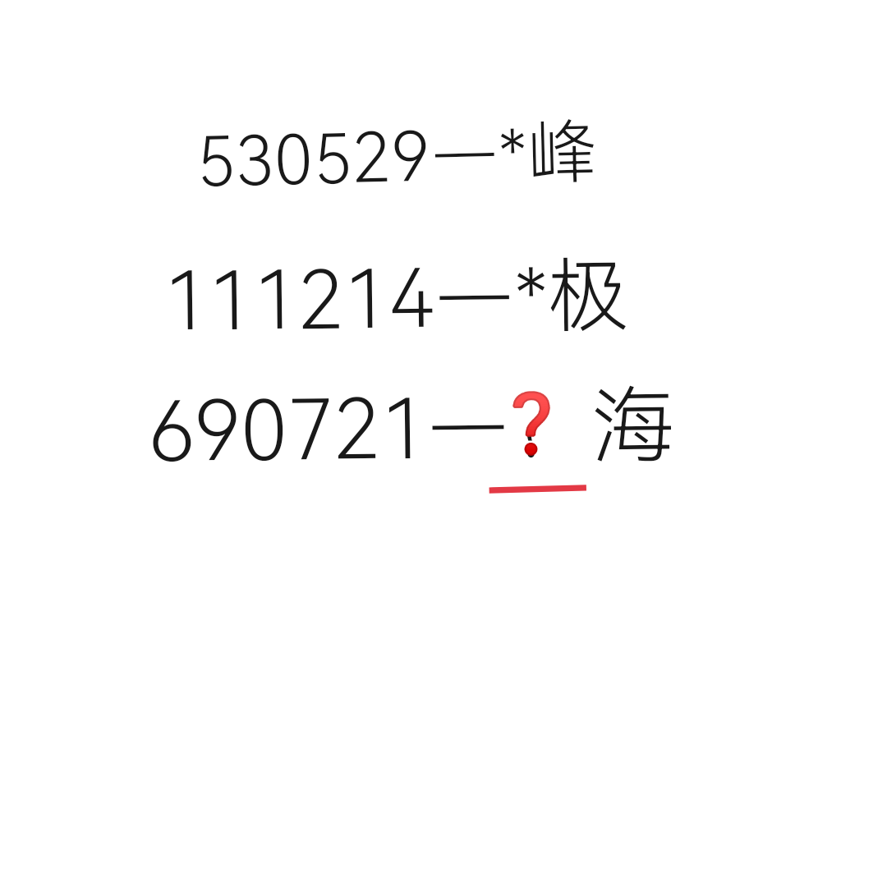

# 千字谜子题 323

## 题面

## 答案

`静`

## 解析

数字对应日期。例如1953年5月29日，新西兰登山家埃德蒙·希拉里与尼泊尔向导丹增·诺尔盖从南坡携手登顶珠穆朗玛峰，这是人类首次征服世界最高峰的记录。同理，第二行是南极。1969年7月21日，阿姆斯特朗登上月球，而结尾是海？那么再细一点，阿姆斯特朗是在静海降落的。所以❓是静。

## 本地附件

- [c5c0925d920c4e229eb7a55657589c7a.webp](../../../assets/static.cipherpuzzles.com/static/images/c5c0925d920c4e229eb7a55657589c7a.webp)

来源：[https://ccbc16.cipherpuzzles.com/data/c16-qian-puzzle.json#cid=323](https://ccbc16.cipherpuzzles.com/data/c16-qian-puzzle.json#cid=323)
