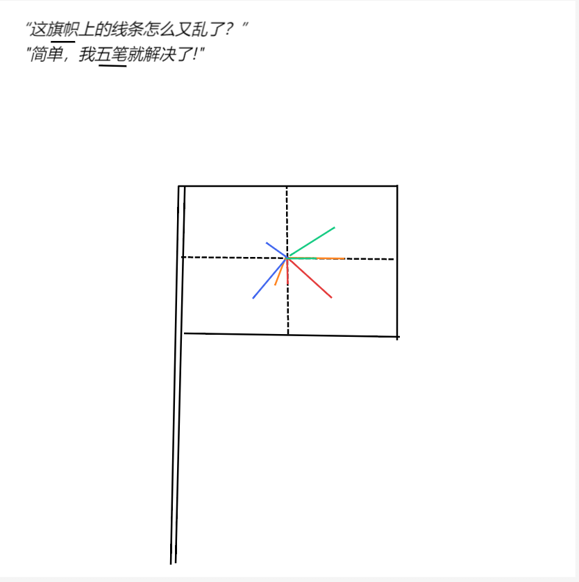

# 千字谜子题 324

## 题面

## 答案

`丙`

## 解析

这道题左上角两句话分别加重『旗帜』和『五笔』提示本题为旗语，五笔的双重加密，首先通过旗帜上的线条，注意到有四种不同的颜色为红黄绿蓝，由红橙黄绿青蓝紫易知排列顺序为红，黄，绿，蓝，由此可单独将同一颜色的两个线条提取出，并且对应标准旗语表知，他们所对应的字母分别为『G M W I』根据五笔输入可知，答案为丙

## 本地附件

- [254f2af2bec54ff2a193c09b01a0a5c0.webp](../../../assets/static.cipherpuzzles.com/static/images/254f2af2bec54ff2a193c09b01a0a5c0.webp)

来源：[https://ccbc16.cipherpuzzles.com/data/c16-qian-puzzle.json#cid=324](https://ccbc16.cipherpuzzles.com/data/c16-qian-puzzle.json#cid=324)
